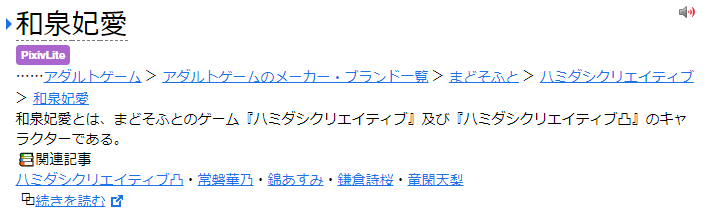

# Yomichan Dictionaries <!-- omit in toc -->

This repository contains dictionaries for [Yomichan](https://foosoft.net/projects/yomichan/)/[Yomitan](https://github.com/themoeway/yomitan), a Japanese dictionary browser extension for Chrome, Firefox, and Edge. The repository was originally created to host the dictionaries I created, but I have since adapted this repository to serve as a hub for other dictionaries as well. If you have a dictionary you would like to share, please open an issue or pull request.

Please note that this repository is not any kind of ranking or endorsement of the listed dictionaries. I use some but not all of the dictionaries listed. Though in general, I recommend installing as many dictionaries as possible for maximum coverage.

### Check out my [JP Resources](https://github.com/MarvNC/JP-Resources)

### [Changelog](https://github.com/MarvNC/yomichan-dictionaries/commits/master/dl)

- [Japanese](#japanese)
  - [Terms](#terms)
    - [JP-EN Term Dictionaries](#jp-en-term-dictionaries)
      - [JMDict](#jmdict)
      - [JMnedict](#jmnedict)
      - [Shoui Bilingual Dictionaries Collection](#shoui-bilingual-dictionaries-collection)
      - [New Saitou Japanese-English Dictionary](#new-saitou-japanese-english-dictionary)
    - [Japanese Monolingual Dictionaries](#japanese-monolingual-dictionaries)
      - [Shoui Monolingual Dictionaries Collection](#shoui-monolingual-dictionaries-collection)
      - [Iwanami Kokugo Jiten](#iwanami-kokugo-jiten)
      - [Jitenon Dictionaries](#jitenon-dictionaries)
    - [Grammar Dictionaries](#grammar-dictionaries)
      - [aiko-tanaka Grammar Dictionaries](#aiko-tanaka-grammar-dictionaries)
    - [Other Term Dictionaries](#other-term-dictionaries)
      - [Pixiv](#pixiv)
      - [niconico-pixiv Terms](#niconico-pixiv-terms)
      - [surasura Onomatopoeia](#surasura-onomatopoeia)
      - [複合語起源 Term Origins](#複合語起源-term-origins)
      - [Gogen Yurai](#gogen-yurai)
    - [Term Frequency](#term-frequency)
      - [jpdb Frequency Dictionary](#jpdb-frequency-dictionary)
      - [Aozora Bunko Jukugo Frequency](#aozora-bunko-jukugo-frequency)
      - [CC100](#cc100)
      - [BCCWJ](#bccwj)
      - [Innocent Ranked](#innocent-ranked)
      - [jpDicts Frequencies](#jpdicts-frequencies)
      - [Youtube Frequency Dictionaries](#youtube-frequency-dictionaries)
      - [Corpus of Everyday Japanese Conversation](#corpus-of-everyday-japanese-conversation)
      - [Shoui Dictionaries Collection Misc. Frequency Dictionaries](#shoui-dictionaries-collection-misc-frequency-dictionaries)
      - [OhTalkWho オタク Frequency Dictionaries](#ohtalkwho-オタク-frequency-dictionaries)
      - [Anacreon's Frequency Dictionaries](#anacreons-frequency-dictionaries)
  - [Kanji](#kanji)
    - [Yomichan CSS for Kanji Dictionaries](#yomichan-css-for-kanji-dictionaries)
    - [Kanji Info](#kanji-info)
      - [KANJIDIC](#kanjidic)
      - [Wiktionary Kanji](#wiktionary-kanji)
      - [jpdb Kanji](#jpdb-kanji)
      - [TheKanjiMap](#thekanjimap)
    - [Kanji Variants](#kanji-variants)
      - [mozc](#mozc)
      - [jitai](#jitai)
    - [Kanji Frequency](#kanji-frequency)
      - [Aozora Bunko Kanji Frequency](#aozora-bunko-kanji-frequency)
      - [Innocent Corpus Kanji Frequency](#innocent-corpus-kanji-frequency)
      - [Wikipedia Kanji Frequency](#wikipedia-kanji-frequency)
      - [jpdb Kanji Frequency](#jpdb-kanji-frequency)
- [Mandarin Chinese](#mandarin-chinese)
  - [Terms](#terms-1)
    - [Term Dictionaries](#term-dictionaries)
      - [Shoui's Chinese Yomichan Setup](#shouis-chinese-yomichan-setup)
      - [Other Chinese Dictionaries](#other-chinese-dictionaries)
    - [Chinese Frequency](#chinese-frequency)
      - [SUBTLEX-CH Subtitle Corpus](#subtlex-ch-subtitle-corpus)
      - [BLCU BCC Corpus](#blcu-bcc-corpus)
      - [General Global Chinese Frequency](#general-global-chinese-frequency)
  - [Hanzi](#hanzi)
    - [Wiktionary Hanzi](#wiktionary-hanzi)
- [Cantonese](#cantonese)
  - [Terms](#terms-2)
    - [CantoDict](#cantodict)
    - [Misc Dictionaries](#misc-dictionaries)
- [Other](#other)
  - [Japanese-Mongolian](#japanese-mongolian)
    - [Japanese-Mongolian/日・モ辞典](#japanese-mongolian日モ辞典)

# Japanese

## Terms

Do check out [yomichan-dict-css](https://github.com/themoeway/yomichan-dict-css) for CSS that colors some term dictionaries to make them more immediately distinguishable.


### JP-EN Term Dictionaries

#### JMDict

**[Download](https://github.com/Aquafina-water-bottle/jmdict-english-yomichan/)**

The most extensive JP-EN dictionary using data from the [EDRDG Project](https://www.edrdg.org/jmdict/j_jmdict.html) created by Jim Breen. The linked version should be the most up to date, with changed by stephenmk to display crucial information that wasn't previously linked and to improve formatting greatly, adding in example sentences as well.

#### JMnedict

**[Download](https://github.com/FooSoft/yomichan/issues/2111#issuecomment-1192238540)**

A dictionary of Japanese proper names. The linked version is advantageous over the one linked on the Yomichan homepage as it clutters the search page much less when searching kana, so it's highly recommended.

#### Shoui Bilingual Dictionaries Collection

**[Download](https://learnjapanese.moe/resources/#dictionaries)**

There are various bilingual dictionaries in Shoui's bilingual folder. Check the readme in the folder for further information.

- 新和英 (Recommended)
  - Same as the 研究社　新和英大辞典　第５版 with better deconjugation but lacking some additional sentences.
- 研究社　新和英大辞典　第５版

#### New Saitou Japanese-English Dictionary

**[Download NEW 斎藤和英大辞典](https://cdn.discordapp.com/attachments/563409909627224095/1093416116661010603/Bilingual_NEW__2.zip)**

A bilingual dictionary by an anon, with lots of example sentences. You may want to limit the amount of example sentences to avoid cluttering the search page by using the following CSS, where the number 5 can be changed:

```css
[data-dictionary='NEW斎藤和英大辞典'] ul.gloss-sc-ul > li:nth-child(n + 5) {
  display: none;
}
```

### Japanese Monolingual Dictionaries

#### Shoui Monolingual Dictionaries Collection

**[Download](https://learnjapanese.moe/resources/#dictionaries)**

There are various monolingual dictionaries in Shoui's monolingual folder, authored by various people. Check the readme in the folder for further information, and check the explanation on [learnjapanese.moe](https://learnjapanese.moe/monolingual/#recommended-dictionaries) on how to use them. Currently contains:

- 広辞苑 第七版
  - Converted by [Thermosphere and shoui](https://github.com/Thermospore/koj72yomi).
- 三省堂国語辞典　第七版 (Recommended)
- 実用日本語表現辞典 (Recommended)
- 新明解国語辞典 第七版 (Recommended)
- 明鏡国語辞典 第二版 (Recommended)
- 旺文社国語辞典 第十一版 (Recommended)
  - Converted by irhello and shoui.
- Weblio 古語辞典
  - Scraped/converted by 昔男/mk68.
- 精選版 日本国語大辞典
- 明鏡国語辞典
- 旺文社国語辞典 第十一版 画像無し
- 新明解国語辞典 第五版
- 故事ことわざの辞典
  - Converted by Thermosphere with Yomichan Import
- 広辞苑 第六版
- 岩波国語辞典 第六版
- 大辞林 第三版
- ハイブリッド新辞林 v2
- デジタル大辞泉
  - Converted by ッツ.
- 新明解四字熟語辞典
  - Converted by ッツ.
- 学研 四字熟語辞典
  - Converted by ッツ.
- 日本語俗語辞書
  - Scraped/converted by Kartoffel.
- 漢字源

#### Iwanami Kokugo Jiten

**[Download 岩波国語辞典　第八版](https://cdn.discordapp.com/attachments/563409909627224095/1094321820548734996/a.zip)**

A monolingual dictionary made by an anon, with very nice formatting and links for related terms.

<details>
  <summary>Images</summary>


</details>

#### Jitenon Dictionaries

**[Download All (unzip first)](https://cdn.discordapp.com/attachments/563409909627224095/1108265551312211999/jitenbot.zip)**

There are many dictionaries available at [辞典オンライン](https://jitenon.jp/) and [using stephenmk's jitenbot](https://github.com/stephenmk/jitenbot), some of these have been scraped for use as Yomichan dictionaries. There are quite a few entries that aren't in other dictionaries, so I'd recommend installing this.

Includes the following dictionaries:

- [四字熟語辞典オンライン](https://yoji.jitenon.jp/)
- [故事・ことわざ・慣用句オンライン](https://kotowaza.jitenon.jp/)
- [国語辞典オンライン](https://kokugo.jitenon.jp/)

<details>
  <summary>Images (click to expand)</summary>


</details>

### Grammar Dictionaries

#### aiko-tanaka Grammar Dictionaries

**[Download](https://github.com/aiko-tanaka/Grammar-Dictionaries)**

A collection of grammar dictionaries scraped and converted by aiko-tanaka. A lot of manual work was put in to creating them to make them parse well, I'd recommend you install all of them. Contains:

- Nihongo no sensei 毎日のんびり日本語教師
- E de wakaru 絵でわかる日本語
- Nihongo Kyoshi JLPT 文法解説まとめ
- Donna Toki どんなときどう使う 日本語表現文型辞典
- DoJG 日本語文法辞典(全集)

### Other Term Dictionaries

#### Pixiv

**[Download](https://github.com/MarvNC/yomichan-dictionaries/raw/master/dl/%5BMonolingual%5D%20PixivLite.zip)**

A complete scrape of the public [dic.pixiv.net](https://dic.pixiv.net/) of approximately 500,000 entries, containing a brief summary and links to related articles for each entry. This dictionary is quite extensive and contains entries for a vast amount of proper nouns that would not be in traditional dictionaries. For instance, 和泉妃愛 has an entry as does likely every notable voice actor, manga, mountain, and VTuber in Japan.

> **Note**
> This is the lite version without readings, a version with kana readings is in the works but it will require a lot of time to scrape.

> **Warning**
> This dictionary is quite large and may take a long time to import.



#### niconico-pixiv Terms

<details>
<summary>Click to expand (obsolete)</summary>

**[Download](https://github.com/MarvNC/yomichan-dictionaries/raw/master/dl/%5BOther%5D%20Nico-Pixiv.zip)**

Using the information [gathered by ncaq for use in an IME](https://github.com/ncaq/dic-nico-intersection-pixiv), this is a dictionary that can help parse terms that are in **both** [niconico](https://dic.nicovideo.jp/) and [pixiv](https://dic.pixiv.net/)'s online dictionaries. These online dictionaries are sort of like encyclopedias of the internet, so many terms such as proper nouns not in traditional dictionaries will be found.

> ルールベースで IME 辞書の役に立たなそうな単語を除外しています。

%E3%81%A8%E3%81%AF%E3%80%90%E3%83%94%E3%82%AF%E3%82%B7%E3%83%96%E7%99%BE%E7%A7%91%E4%BA%8B%E5%85%B8%E3%80%91_-_httpsdic.pixiv.net_2022-08-21_17-22-10.png>)

</details>

#### surasura Onomatopoeia

**[Download](https://github.com/MarvNC/yomichan-dictionaries/raw/master/dl/%5BMonolingual%5D%20surasura.zip)**

A dictionary of onomatopoeia from [surasura.com](http://sura-sura.com/). Contains some onomatopoeia that are not in any other dictionaries. Credit to [stephenmk](https://github.com/stephenmk) for the idea to mark information using those emojis with his [improved JMDict](https://github.com/FooSoft/yomichan-import/pull/40).

For each entry, it contains:

- A few definitions
- An extended explanation if available, marked with the ℹ️ emoji
- A few example sentences marked with the 🇯🇵 flag emoji


#### 複合語起源 Term Origins

**[Download](https://github.com/MarvNC/yomichan-dictionaries/raw/master/dl/%5BOther%5D%20%E8%A4%87%E5%90%88%E8%AA%9E%E8%B5%B7%E6%BA%90.zip)** | **[List of words](termOrigins/%E8%A4%87%E5%90%88%E8%AA%9E%E8%B5%B7%E6%BA%90.tsv)**

Compound kunyomi word origins, for example 陥る -> 落ち入る（おち|いる）. Information comes from anonymous forum posts, so it may not be 100% accurate.


**Sources:**

- [shitaraba](https://jbbs.shitaraba.net/bbs/read.cgi/study/10958/1299762655/)
- [5ch](https://academy6.5ch.net/test/read.cgi/gengo/1228873581/)
- [Wanikani](https://community.wanikani.com/t/special-kanji-words-derived-from-other-words/35655)

#### Gogen Yurai

**[Download](https://cdn.discordapp.com/attachments/778430038159655012/1025059429206466580/gogen.zip)**

語源由来辞典 parsed from https://gogen-yurai.jp/ by Seikou. Contains a information about the origins of words.

### Term Frequency

#### jpdb Frequency Dictionary

**[Download](https://github.com/MarvNC/jpdb-freq-list/releases)**

A frequency dictionary based on information scraped from https://jpdb.io in May of 2022. More information can be found [here](https://github.com/MarvNC/jpdb-freq-list).

Due to the way the data was scraped, some terms are missing frequencies and the jpdb dictionary itself is limited to terms in JMDict. For example, 経緯 only has an entry for the いきさつ reading so it should not be used as a dictionary for sorting (the more common/correct reading is けいい). However, the corpus of JPDB is quite good for immersion learners as it covers anime, dramas, light novels, visual novels, and web novels so the frequencies will be relatively accurate to what you're actually reading. This dictionary is notable for displaying the frequencies of kana readings separately, so you can often get a sense of how often a word is written with kanji or not.

#### Aozora Bunko Jukugo Frequency

**[Download](https://github.com/MarvNC/yomichan-dictionaries/raw/master/dl/%5BFreq%5D%20Aozora%20Bunko.zip)**

A frequency dictionary created using data [collected by vrtm](https://vtrm.net/japanese/kanji-jukugo-frequency/en) based on the [Aozora Bunko](https://www.aozora.gr.jp/). Due to the [methodology used](https://vtrm.net/japanese/kanji-jukugo-frequency/en), this dictionary does not cover words with kana in them but it covers many rare 熟語 not covered by other frequency dictionaries, such as 睽乖.

#### CC100

**[Download](https://cdn.discordapp.com/attachments/778430038159655012/1025058653511893143/Freq_CC100.zip)**

Made by the mind behind [arujisho](https://github.com/emc2314/arujisho), this uses the [CC100 dataset](https://data.statmt.org/cc-100/) which was made by crawling the web. Coverage is very wide, and there is reason behind the way readings are differentiated which is why I use this as my Yomichan sort dictionary.

<details>
<summary>Original message by Seikou</summary>

> Hello everyone! Recently I tokenized the [CC-100](https://data.statmt.org/cc-100/) Japanese dataset (which is a high quality dataset filtered from Commoncrawl web crawl data, and is about 70GB large) as a corpus using mecab(fugashi) and sudachi, resulting a frequency rank list of about 900k words. After filtering it using several monolingual dictionaries, I got a freq rank list of roughly 160k words.

</details>

#### BCCWJ

**[Download](https://github.com/toasted-nutbread/yomichan-bccwj-frequency-dictionary/releases)**

From the [publication](https://link.springer.com/article/10.1007/s10579-013-9261-0):

> The balanced corpus of contemporary written Japanese (BCCWJ) is Japan’s first 100 million words balanced corpus. It consists of three subcorpora (publication subcorpus, library subcorpus, and special-purpose subcorpus) and covers a wide range of text registers including books in general, magazines, newspapers, governmental white papers, best-selling books, an internet bulletin-board, a blog, school textbooks, minutes of the national diet, publicity newsletters of local governments, laws, and poetry verses.

It has extremely wide coverage with most terms you'll encounter having an entry in this list even if other frequency lists don't. In addition, it differentiates between readings quite well. Make sure to install the LUW version as it has more terms.

#### Innocent Ranked

**[Download](https://learnjapanese.moe/resources/#dictionaries)**

The Innocent Corpus from the [Yomichan page](https://github.com/FooSoft/yomichan#dictionaries) but reordered to be sorted by rank. It is based on data [from 5000+ novels](https://web.archive.org/web/20190309073023/https://forum.koohii.com/thread-9459.html#pid168613). A weakness is that it does not differentiate based on reading, so all readings of a term will show the same value.

#### jpDicts Frequencies

**[Download](https://cdn.discordapp.com/attachments/778430038159655012/942796687401967616/Freq_Monodicts_206k.zip)**

A frequency dictionary created using monolingual dictionary definitions as the corpus, so it might be useful for those who really like reading dictionaries. Made by Avratzzz.

<details>
<summary>Dictionaries used:</summary>

- ハイブリッド新辞林 v2
- 故事ことわざの辞典
- 漢字源
- 精選版 日本国語大辞典
- 新明解四字熟語辞典
- 学研 四字熟語辞典
- 実用日本語表現辞典
- 明鏡国語辞典
- 旺文社国語辞典 第十一版
- 新明解国語辞典 第五版
- 大辞林 第三版
- デジタル大辞泉
- 岩波国語辞典 第六版
- 広辞苑 第六版

</details>

#### Youtube Frequency Dictionaries

**[Download the full Youtube Frequency Dictionary](https://cdn.discordapp.com/attachments/778430038159655012/933399848500228146/YoutubeFreqV3.zip)**

**[Download all domain-specific dictionaries](https://cdn.discordapp.com/attachments/778430038159655012/933392359603986482/YouTubeFreqs.zip)**

> Using data from 40k manually transcribed YouTube videos we have created 16 domain specific frequency lists for YomiChan.
> Enjoy and feel free to share around. Created by @Zetta @Vexxed @Anonymous

Domain-specific frequency lists from Youtube Videos:

<details>
<summary>Domains:</summary>

- Vlogs
- Vehicles
- Travel
- TEDx
- Sports
- SciTech
- Pets/Animals
- Nonprofits
- News
- Music
- HowtoStyle
- Gaming
- Film/Anime
- Entertainment
- Education
- Comedy

</details>

#### Corpus of Everyday Japanese Conversation

**[Download](https://github.com/MarvNC/Corpus-of-Everyday-Japanese-Conversation---Yomichan-Frequency-Dictionary/tree/add-download-table)**

Converted by n-manas, based on the [Corpus of Everyday Japanese Conversation](https://www.ninjal.ac.jp/english/research/cr-project/project-3/institute/spoken-language/).

> The Corpus of Everyday Japanese Conversation (CEJC) is a vocabulary and word count table based on 200 hours of recorded data (approximately from April 2016 to 2020).

> Our project will develop a large-scale corpus of Japanese everyday conversation in a balanced manner. Since informants record their conversations in everyday situations by themselves, naturally occurring conversations can be collected. To build an empirical foundation for the corpus design, we conducted a survey of ordinary conversational behavior of about 250 adults."

> Since there were several ranks included in the file, the overall rank was chosen to generate this frequency dictionary.

#### Shoui Dictionaries Collection Misc. Frequency Dictionaries

Some other miscellaneous frequency dictionaries in the [Shoui Dictionaries Collection](https://learnjapanese.moe/resources/#dictionaries).

- Anime & J-drama
- [Narou](http://wiki.wareya.moe/Narou) Freq
- Novels
- VN Freq v2
- Wikipedia v2
- 国語辞典
- Nier

#### OhTalkWho オタク Frequency Dictionaries

**[Download](https://docs.google.com/document/d/1IUWkvBxhoazBSTyRbdyRVk7hfKE51yorE86DCRNQVuw/edit)**

Some frequency dictionaries made by this YouTuber [OhTalkWho オタク](https://www.youtube.com/watch?v=DwJWld8hW0M).

- Netflix
- Top 100 Shonen
- Top 100 Slice of Life
- JLPT Level Tags
- Novel 5k
  - This might just be innocent corpus with stars?
- Visual Novels
  - Might be based off [vnstats](http://wiki.wareya.moe/)? It's different than the VN Freq v2 in Shoui's Dictionaries Collection.

#### Anacreon's Frequency Dictionaries

**[Download](https://anacreondjt.gitlab.io/docs/freq/)**

Some frequency dictionaries made by Anacreon that are not rank-based, but rather percentage-based where the displayed value is the percent of that corpus you would be able to read if you knew every word with that percentage or lower. They are somewhat redundant with other previously mentioned dictionaries, but some people may prefer the percentage-based approach.

> Frequency is displayed as a number between MOST frequent 0 and LEAST frequent 100. Check out this graph, essentially the number in these dicts are the Y axis of [this graph](https://anacreondjt.gitlab.io/img/graph.png). So if you were aiming for understanding 95% of words you come across the most efficient way would be to mine all the words with a freq less than or equal 95.

- Visual Novels (from [vnstats](http://wiki.wareya.moe/))
- [Narou](http://wiki.wareya.moe/Narou)
- BCCWJ2

## Kanji

### Yomichan CSS for Kanji Dictionaries

Yomichan and KANJIDIC by default have a lot of bloat in the kanji dictionary viewer, like repeating the kanji stroke order image, frequency information, and unused table rows for every entry. For using multiple kanji dictionaries, you can use some CSS to make the kanji display more compact like it is for terms.


In `Settings -> Popup Appearance -> Configure custom CSS...` input the following CSS for more compact display of entries.

```css
/* remove misc dict classifications/codepoints/stats */
.kanji-glyph-data > tbody > tr:nth-child(n + 3) {
  display: none;
}

/* remove stroke diagram, freq, header for next entries */
div.entry[data-type='kanji']:nth-child(n + 2) .kanji-glyph-container,
div.entry[data-type='kanji']:nth-child(n + 2) [data-section-type='frequencies'],
div.entry[data-type='kanji']:nth-child(n + 2) table.kanji-glyph-data > tbody > tr:first-child {
  display: none;
}

/* remove 'No data found' */
.kanji-info-table-item-value-empty {
  display: none;
}

/* reduce extra padding */
.kanji-glyph-data,
div.entry[data-type='kanji'],
div.entry[data-type='kanji']:nth-child(n + 2) .kanji-glyph-data > tbody > tr > *,
.kanji-glyph-data dl.kanji-readings-japanese,
div.entry[data-type='kanji']:nth-child(n + 2)
  .kanji-glyph-data
  dl.kanji-readings-chinese[data-count='0'] {
  padding-top: 0 !important;
  padding-bottom: 0 !important;
  margin-bottom: 0em;
  margin-top: 0 !important;
}
/* remove horizontal lines */
.entry + .entry[data-type='kanji'],
div#dictionary-entries > div.entry:nth-child(n + 2) .kanji-glyph-data > tbody > tr > * {
  border-top: none !important;
}
/* change decimal list */
.kanji-gloss-list {
  list-style-type: circle;
}
```

### Kanji Info

#### KANJIDIC

**[Download](https://github.com/themoeway/yomitan/raw/dictionaries/kanjidic_english.zip)**

The [KANJIDIC Project](http://www.edrdg.org/wiki/index.php/KANJIDIC_Project)'s KANJIDIC is the primary English kanji dictionary used in Yomichan and contains information about most kanji, notably English definitions, readings, and some other statistics like stroke count, JLPT, grade level.

#### Wiktionary Kanji

**[Download](https://github.com/MarvNC/yomichan-dictionaries/raw/master/dl/%5BKanji%5D%20Wiktionary.zip)**

Kanji information of around 18,000 characters from [Wiktionary](https://ja.wiktionary.org/), notably:

- 呉音, 漢音, 唐音, 宋音, 慣用音 onyomi readings of kanji ([further reading](<https://en.wikipedia.org/wiki/Kanji#On'yomi_(Sino-Japanese_reading)>))
- 字源 - information about how and why a kanji is composed the way it is, including the [type of composition it is](https://en.wikipedia.org/wiki/Kanji#Types_of_kanji_by_category)
- The meaning of the kanji (in Japanese)
- The various 異体字 of the kanji


#### jpdb Kanji

**[Download](https://github.com/MarvNC/yomichan-dictionaries/raw/master/dl/%5BKanji%5D%20JPDB%20Kanji.zip)**

Kanji information of around 6,000 characters from https://jpdb.io:

- The 15 most common vocab applicable
- The kanji decomposition according to jpdb (has inaccuracies because it's meant for memorizing keywords)
- 漢字検定 level
- 旧字体/新字体/拡張新字体 character form


#### TheKanjiMap

**[Download](https://github.com/MarvNC/yomichan-dictionaries/raw/master/dl/%5BKanji%5D%20TheKanjiMap.zip)** | [List of possible phonetic components](thekanjimap/readingHints.tsv)

Information from [TheKanjiMap](https://thekanjimap.com/):

- Radical information for all radicals
- Kanji decomposition (**more accurate than JPDB**)
- List of all kanji that contain a kanji/component/radical
- Reading hints based on possible phonetic components (computed based on information from KANJIDIC and the decomposition here)


### Kanji Variants

#### mozc

**[Download](https://github.com/MarvNC/yomichan-dictionaries/raw/master/dl/%5BKanji%5D%20mozc%20Kanji%20Variants.zip)**

A kanji dictionary made from the kanji variant information in [Google's mozc Japanese IME](https://github.com/google/mozc). Includes information about:

- 異体字
- 印刷標準字体
- 簡易慣用字体
- 旧字体
- 略字
- 正字
- 俗字
- 別字
- 本字


#### jitai

**[Download](https://github.com/MarvNC/yomichan-dictionaries/raw/master/dl/%5BKanji%5D%20jitai.zip)**

A kanji dictionary made using the data from [jitai](https://github.com/epistularum/jitai). This allows you to see information about 旧字体, 新字体, 拡張新字体, and 標準字体 variants from the kanji page in Yomichan.


### Kanji Frequency

#### Aozora Bunko Kanji Frequency

**[Download](https://github.com/MarvNC/yomichan-dictionaries/raw/master/dl/%5BKanji%20Frequency%5D%20Aozora%20Bunko.zip)**

A kanji frequency dictionary created using data [collected by vrtm](https://vtrm.net/japanese/kanji-frequency/en) based on the [Aozora Bunko](https://www.aozora.gr.jp/).

#### Innocent Corpus Kanji Frequency

**[Download](https://github.com/MarvNC/yomichan-dictionaries/raw/master/dl/%5BKanji%20Frequency%5D%20Innocent%20Corpus%20Kanji.zip)**

Uses the [innocent corpus frequency list](https://web.archive.org/web/20190309073023/https://forum.koohii.com/thread-9459.html#pid168613) that is distributed with [Yomichan](https://github.com/FooSoft/yomichan#dictionaries) to create a rank-based kanji frequency dictionary. This was created because the existing one is an occurence-based list and does not display ranks.

- The displayed frequency in Yomichan will contain the frequency rank followed by the occurence count, for example `4686 (57)` for 壟 indicating it's the 4686th most common kanji and appeared 57 times total in the 5000+ novels in Innocent Corpus.

#### Wikipedia Kanji Frequency

**[Download](https://github.com/MarvNC/yomichan-dictionaries/raw/master/dl/%5BKanji%20Frequency%5D%20Wikipedia.zip)**

Rank-based kanji frequency data from a May 2015 dump of Japanese Wikipedia, containing around 2 万 kanji. Data [gathered by scriptin](https://github.com/scriptin/kanji-frequency).

#### jpdb Kanji Frequency

**[Download](https://github.com/MarvNC/yomichan-dictionaries/raw/master/dl/%5BKanji%20Frequency%5D%20JPDB%20Kanji.zip)**

Kanji frequency data from https://jpdb.io.

# Mandarin Chinese

## Terms

### Term Dictionaries

#### Shoui's Chinese Yomichan Setup

**[Shoui's Chinese Yomichan Setup](https://gist.github.com/shoui520/25460fd2e9fb194d3e5152fa2ce42ca2#installing-dictionaries-and-basic-usage)**

Shoui's guide to setting up Yomichan for Chinese, includes links for:

- [ZH-EN] CEDICT
- [ZH-JA] 中日大辞典　第二版
- [ZH-ZH] 兩岸詞典
- [ZH-ZH] 漢語大詞典
- [ZH-ZH] 萌典国语辞典 (简体字)

#### Other Chinese Dictionaries

Not sure who made these, but some dictionaries available on this [Google Drive](https://drive.google.com/drive/folders/14OiowSI28LcP_rtGVuis7Sy8Kt_yqsiI). Includes:

- 萌典.pinyin
- 萌典
- 牛津英汉汉英词典
- 现代汉语规范词典
- 譯典通英漢雙向字典
- 五南國語活用辭典

### Chinese Frequency

#### SUBTLEX-CH Subtitle Corpus

**[Download](https://cdn.discordapp.com/attachments/1054623082867855420/1120840723110055996/zhfreq_subs.zip)**

This is a subtitles frequency list based on over 6,000 simplified Chinese movies and TV shows from the [SUBTLEX](http://crr.ugent.be/programs-data/subtitle-frequencies/subtlex-ch) frequency list, which was compiled by Ghent University. Thanks to nadavspi and Michel who converted it for Yomichan.

#### BLCU BCC Corpus

| Title       | Corpus                                         | Download                                                                                                |
| ----------- | ---------------------------------------------- | ------------------------------------------------------------------------------------------------------- |
| `BLCUmixed` | Mixed (Magazines, Literature, Weibo, Tech)     | [Link](https://cdn.discordapp.com/attachments/1054623082867855420/1120840722141171712/zhfreq_mixed.zip) |
| `BLCUlit`   | Literature                                     | [Link](https://cdn.discordapp.com/attachments/1054623082867855420/1120840721851760741/zhfreq_lit.zip)   |
| `BLCUnews`  | Newspapers                                     | [Link](https://cdn.discordapp.com/attachments/1054623082867855420/1120840722405396520/zhfreq_news.zip)  |
| `BLCUsci`   | Scientific and Technological Academic Journals | [Link](https://cdn.discordapp.com/attachments/1054623082867855420/1120840722816450630/zhfreq_sci.zip)   |
| `BLCUcoll`  | Dialogue (Weibo and Movie/TV Subtitles)        | [Link](https://cdn.discordapp.com/attachments/1054623082867855420/1120840721541369926/zhfreq_coll.zip)  |

A Yomichan frequency list made from the Beijing Language and Culture University (BLCU)'s [BLCU Corpus Center (BCC)'s corpus](http://bcc.blcu.edu.cn/help#intro). Thanks to nadavspi and Michel who converted it for Yomichan.

#### General Global Chinese Frequency

**[Frequency](https://cdn.discordapp.com/attachments/1054623082867855420/1054827030312648824/global_freq.zip)**

A general Chinese frequency dictionary that is likely based off of "the chinese internet, movies, books, etc as a whole" according to its author [Kamui](https://github.com/kamui-fin).

## Hanzi

See [Yomichan CSS for Kanji Dictionaries](#yomichan-css-for-kanji-dictionaries) for CSS used to reduce the clutter included by default in Yomichan.

> **Warning**
> The default kanji stroke order font included with Yomichan is made for kanji stroke orders, and as thus will contain incorrect glyphs and stroke orders for Chinese that may be misleading. You can change this by using some CSS:

```css
.kanji-glyph {
  font-family: sans-serif; /* or a whatever font you prefer for Chinese */
}
```

### Wiktionary Hanzi

**[Download](https://github.com/MarvNC/yomichan-dictionaries/raw/master/dl/%5BHanzi%5D%20Wiktionary.zip)**

Hanzi information of nearly 100,000 characters from [ZH Wiktionary](https://zh.wiktionary.org/). Due to the complexity of the wiktionary pages, it will display most of the text on the page, excluding tables and such so the pinyin readings may not be included for many characters. In addition, do note that for some uncommonly used characters there is little information available as the wiki pages often consist of just unicode information and code points, which was stripped from the dictionary.


# Cantonese

## Terms

### CantoDict

**[Download](https://github.com/MarvNC/yomichan-dictionaries/raw/master/dl/%5BCantonese%5D%20Cantodict.zip)**

[CantoDict](http://www.cantonese.sheik.co.uk/dictionary/) was a Cantonese-English dictionary created and maintained by Adam Sheik and public contributors. It was abandoned, but the data was archived thanks to awong-dev at https://github.com/awong-dev/cantodict-archive. This dictionary is based off of the archived data.


### Misc Dictionaries

**[Download](https://drive.google.com/drive/folders/1aybpEp9_-JlOpvnJ8-5c0qlfachb83nA?usp=share_link)**

Thanks to richter_belmont on the Refold Cantonese Discord:

> I converted all of the Migaku dictionaries from the "Learn Cantonese!" shared folder on Google Drive into Yomichan dictionaries. List of dictionaries available are:

- Canto CEDICT
- CC-Canto
- CE Wiktionary
- Words.hk C-C
- Words.hk C-E

# Other

## Japanese-Mongolian

### Japanese-Mongolian/日・モ辞典

**[Download](https://github.com/MarvNC/yomichan-dictionaries/raw/master/dl/%5BJP-Mongolian%5D%20Japanese-Mongolian%20%E6%97%A5%E3%83%BB%E3%83%A2%E8%BE%9E%E5%85%B8.zip)** | [No example sentences version](<https://github.com/MarvNC/yomichan-dictionaries/raw/master/dl/%5BJP-Mongolian%5D%20Japanese-Mongolian%20%E6%97%A5%E3%83%BB%E3%83%A2%E8%BE%9E%E5%85%B8%20(No%20Sentences).zip>)

A Japanese to Mongolian dictionary scraped from [栗林均's site](http://hkuri.cneas.tohoku.ac.jp/). It contains about 19,000 entries.

> 現代日・モ辞典
> 橋本勝、エルデネ・プレブジャブ『現代日本語モンゴル語辞典』春風社、2001．


