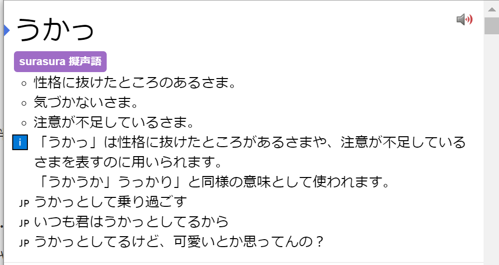
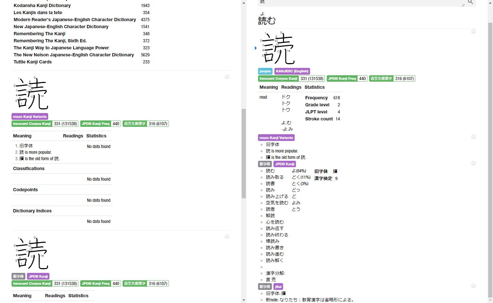
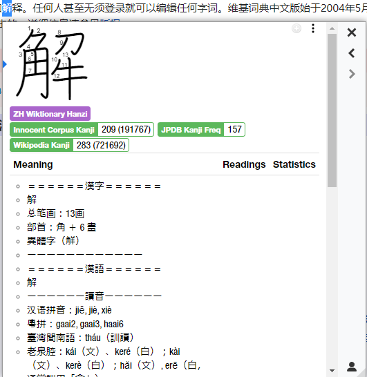
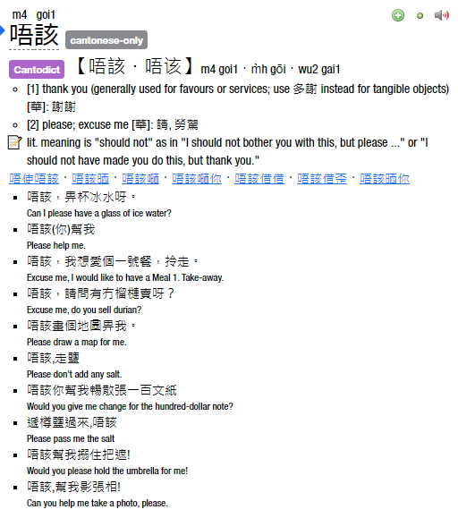
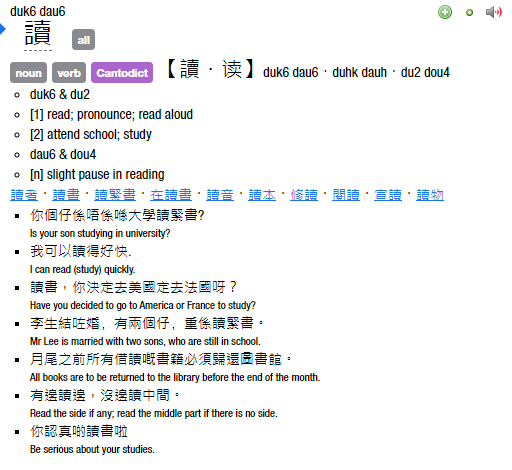
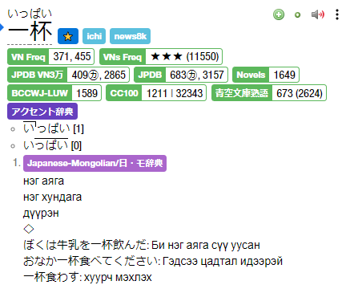

# Yomichan/Yomitan Dictionaries <!-- omit in toc -->

A comprehensive collection of Japanese and Chinese dictionaries for Yomichan/Yomitan, including
terms, kanji/hanzi info, frequency, and variants with both monolingual and bilingual dictionaries
available.

This repository contains dictionaries for
[Yomichan](https://foosoft.net/projects/yomichan/)/[Yomitan](https://github.com/themoeway/yomitan),
a Japanese dictionary browser extension for Chrome, Firefox, and Edge. The repository was originally
created to host the dictionaries I created, but I have since adapted this repository to serve as a
hub for other dictionaries as well. If you have a dictionary you would like to share, please open an
issue or pull request.

**[Please check here for information on what dictionaries to install.](#dictionary-collection)**

My related dictionary resources:

- [**How Do I Make A Yomichan Dictionary?**](how-to-make-yomichan-dictionaries.md)
- [**Yomitan Dictionary Stats**](https://github.com/MarvNC/yomitan-dict-stats) - Information such as
  metadata and entry counts for many Yomichan dictionaries.
- [**Yomichan Dictionary Builder**](https://github.com/MarvNC/yomichan-dict-builder/) - A node
  package I built to help with making dictionaries. It greatly simplifies the process of making
  dictionaries, please try it out if you use TypeScript or JavaScript.

### Table of Contents <!-- omit in toc -->

- [Dictionary Collection](#dictionary-collection)
  - [What Dictionaries Should I Install?](#what-dictionaries-should-i-install)
  - [Dictionaries Sort Script](#dictionaries-sort-script)
- [Japanese](#japanese)
  - [Terms](#terms)
    - [JP-EN Term Dictionaries](#jp-en-term-dictionaries)
    - [Japanese Monolingual Dictionaries](#japanese-monolingual-dictionaries)
    - [Grammar Dictionaries](#grammar-dictionaries)
    - [Term Frequency](#term-frequency)
  - [Kanji](#kanji)
    - [Yomichan CSS for Kanji Dictionaries](#yomichan-css-for-kanji-dictionaries)
    - [Kanji Info](#kanji-info)
    - [Kanji Variants](#kanji-variants)
    - [Kanji Frequency](#kanji-frequency)
- [Yomitan CSS for Non-Japanese CJK Languages](#yomitan-css-for-non-japanese-cjk-languages)
- [Mandarin Chinese](#mandarin-chinese)
  - [Terms](#terms-1)
    - [Term Dictionaries](#term-dictionaries)
    - [Chinese Frequency](#chinese-frequency)
  - [Hanzi](#hanzi)
    - [Wiktionary Hanzi](#wiktionary-hanzi)
- [Cantonese](#cantonese)
  - [Cantonese Terms](#cantonese-terms)
    - [Words.hk](#wordshk)
    - [CantoDict](#cantodict)
    - [Misc Dictionaries](#misc-dictionaries)
  - [Cantonese Term Frequency](#cantonese-term-frequency)
    - [Words.hk Frequency](#wordshk-frequency)
    - [Cifu](#cifu)
- [Japanese-German](#japanese-german)
  - [Wadoku Jiten](#wadoku-jiten)
  - [Wadoku Daijiten](#wadoku-daijiten)
- [Indonesian-English](#indonesian-english)
- [Japanese-Mongolian](#japanese-mongolian)
  - [Japanese-Mongolian/日・モ辞典](#japanese-mongolian日モ辞典)
- [Korean](#korean)
- [Vietnamese-English](#vietnamese-english)
- [Other](#other)

# Dictionary Collection

**[Dictionaries Folder Download](https://drive.google.com/drive/folders/1LXMIOoaWASIntlx1w08njNU005lS5lez)**

**[Changelog](dict-changelog.md)**

Here is a folder containing all the Japanese, Mandarin, and Cantonese dictionaries that I personally
use and would recommend. I usually keep up to date with the latest versions of the dictionaries, and
the folder is configured to automatically download and import the regularly updating dictionaries
such as Jitendex, JMnedict, and KANJIDIC. If there is a dictionary in the folder that is outdated,
please let me know!

<!-- prettier-ignore -->
> [!TIP]
> - **But scrolling to the next entry takes too long!**
> - Here are some shortcuts that may or may not help you with this:
>   - `alt + scroll down`
>   - `alt + pagedown`
>   - `alt + down arrow`

<!-- prettier-ignore -->
> [!IMPORTANT] 
> The collection is not complete as there are some dictionaries I feel are outdated or
> unnecessary or have simply chosen not to install. For these as well as older and alternate 
> versions of dictionaries, I recommend checking out
> [Shoui's Dictionary Collection](https://learnjapanese.moe/resources/#dictionaries).

## What Dictionaries Should I Install?

If you're a beginner, I recommend following
[Shoui's Yomichan Setup](https://learnjapanese.moe/yomichan/). I would say the _bare minimum_ is:

- Bilingual:
  - [JA-EN] jitendex-yomichan
  - [JA-EN] NEW 斎藤和英大辞典
  - [JA-EN] 新和英
- Grammar:
  - [JA Grammar] dojg-consolidated-v1_01
- Frequency:
  - [JA Freq] JPDB_2022-05-10T03_27_02.930Z
  - [JA Freq] Freq_CC100
  - [JA Freq] BCCWJ-LUW
- Monolingual but still useful for coverage to a beginner! If a word shows up in one of these
  dictionaries but not an English one, you can just web search/translate to find out more
  information.
  - [JA-JA] 実用日本語表現辞典
  - [JA-JA] デジタル大辞泉
  - [JA-JA Encyclopedia] Pixiv
- Kanji information
  - [Kanji] KANJIDIC_english
  - [Kanji] JPDB Kanji
- Pitch accent
  - [Pitch] 大辞泉

If you're a bit more familiar with the language, I highly recommend following
[Kuri's Yomichan Setup](https://donkuri.github.io/learn-japanese/setup/#adding-dictionaries) which
goes in depth with the technical setup process and recommends you install around thirty
dictionaries, with a lot of thought having been put into the selections.

My personal recommendation is to install everything. With every dictionary installed, you know that
any (actual) word you come across will almost certainly be in your Yomitan installation, and that
you will have a good selection of definitions for almost any word. Most dictionaries on their own do
not that high of a breadth of coverage so having less dictionaries installed means you may run into
confusion when you fail to look up a word. Some of the dictionaries cover quite different subject
areas as well - hover a cultural reference and you will be more likely to find it in the Pixiv
dictionary than any other.

## Dictionaries Sort Script

If you install a lot of dictionaries and/or sync your dictionary collection across multiple devices,
it can be quite the ordeal to change the sort order with the way Yomitan's UI is set up. I have
written a script that will automatically sort your dictionaries for you. You can find it here:
[**Yomitan Dictionaries Sort Script**](https://raw.githubusercontent.com/MarvNC/yomichan-dictionaries/master/sort-dictionaries.js).

To use it, simply copy the script, open the Yomitan options page, open the console, paste the
script, and press enter. It will automatically sort your dictionaries for you.

By default, the sort order used is the one that I use and it supports all the dictionaries in the
folder. If you want to use a different sort order, you can edit the script to change the `order`
variable at the top.

# Japanese

For an easy download of the dictionaries I use, check out [this folder](#dictionary-collection).

Do check out [yomichan-dict-css](https://github.com/themoeway/yomichan-dict-css) for CSS that colors
some term dictionaries to make them more immediately distinguishable.


## Terms

### JP-EN Term Dictionaries

#### Jitendex

**[Jitendex](https://github.com/stephenmk/Jitendex)**

Jitendex is a free and openly licensed Japanese-to-English dictionary built upon data from JMdict
and other projects. It is the successor to JMdict for Yomichan.

#### JMDict

**[Download](https://github.com/MarvNC/jmdict-yomitan)**

The most extensive JP-EN dictionary using data from the
[EDRDG Project](https://www.edrdg.org/jmdict/j_jmdict.html) created by Jim Breen. It is recommended
you use Jitendex unless you need a legacy version of the dictionary for technical reasons.

#### JMnedict

**[Download](https://github.com/MarvNC/jmdict-yomitan)**

A dictionary of Japanese proper names. The linked version is advantageous over the one linked on the
Yomichan homepage as it clutters the search page much less when searching, so it's highly
recommended.

#### Shoui Bilingual Dictionaries Collection

**[Download](https://learnjapanese.moe/resources/#dictionaries)**

There are various bilingual dictionaries in Shoui's bilingual folder. Check the readme in the folder
for further information.

- 新和英 (Recommended)
  - Same as the 研究社　新和英大辞典　第５版 with better deconjugation but lacking some additional
    sentences.
- 研究社　新和英大辞典　第５版

#### New Saitou Japanese-English Dictionary

**[Download NEW 斎藤和英大辞典](https://cdn.discordapp.com/attachments/563409909627224095/1093416116661010603/Bilingual_NEW__2.zip)**

A bilingual dictionary by an anon, with lots of example sentences. You may want to limit the amount
of example sentences to avoid cluttering the search page by using the following CSS, where the
number 5 can be changed:

```css
[data-dictionary='NEW斎藤和英大辞典'] ul.gloss-sc-ul > li:nth-child(n + 5) {
  display: none;
}
```

### Japanese Monolingual Dictionaries

#### Shoui Monolingual Dictionaries Collection

**[Download](https://learnjapanese.moe/resources/#dictionaries)**

There are various monolingual dictionaries in Shoui's monolingual folder, authored by various
people. Check the readme in the folder for further information, and check the explanation on
[learnjapanese.moe](https://learnjapanese.moe/monolingual/#recommended-dictionaries) on how to use
them. Currently contains:

- 広辞苑 第七版
  - Converted by [Thermosphere and shoui](https://github.com/Thermospore/koj72yomi).
- 三省堂国語辞典　第七版 (Recommended)
- 実用日本語表現辞典 (Recommended)
- 新明解国語辞典 第七版 (Recommended)
- 明鏡国語辞典 第二版 (Recommended)
- 旺文社国語辞典 第十一版 (Recommended)
  - Converted by irhello and shoui.
- Weblio 古語辞典
  - Scraped/converted by 昔男/mk68.
- 精選版 日本国語大辞典
- 明鏡国語辞典
- 旺文社国語辞典 第十一版 画像無し
- 新明解国語辞典 第五版
- 故事ことわざの辞典
  - Converted by Thermosphere with Yomichan Import
- 広辞苑 第六版
- 岩波国語辞典 第六版
- 大辞林 第三版
- ハイブリッド新辞林 v2
- デジタル大辞泉
  - Converted by ッツ.
- 新明解四字熟語辞典
  - Converted by ッツ.
- 学研 四字熟語辞典
  - Converted by ッツ.
- 日本語俗語辞書
  - Scraped/converted by Kartoffel.
- 漢字源

#### Iwanami Kokugo Jiten

**[Download 岩波国語辞典　第八版](https://cdn.discordapp.com/attachments/563409909627224095/1094321820548734996/a.zip)**

A monolingual dictionary made by an anon, with very nice formatting and links for related terms.

<details>
  <summary>Images</summary>


</details>

#### Jitenon Dictionaries

**[Download All (unzip first)](https://cdn.discordapp.com/attachments/563409909627224095/1108265551312211999/jitenbot.zip)**

There are many dictionaries available at [辞典オンライン](https://jitenon.jp/) and
[using stephenmk's jitenbot](https://github.com/stephenmk/jitenbot), some of these have been scraped
for use as Yomichan dictionaries. There are quite a few entries that aren't in other dictionaries,
so I'd recommend installing this.

Includes the following dictionaries:

- [四字熟語辞典オンライン](https://yoji.jitenon.jp/)
- [故事・ことわざ・慣用句オンライン](https://kotowaza.jitenon.jp/)
- [国語辞典オンライン](https://kokugo.jitenon.jp/)

<details>
  <summary>Images (click to expand)</summary>


</details>

#### Sankoku Eighth Edition

**[三省堂国語辞典　第八版](https://www.mediafire.com/file/1quamrofz1ldbp1/%25E4%25B8%2589%25E7%259C%2581%25E5%25A0%2582%25E5%259B%25BD%25E8%25AA%259E%25E8%25BE%259E%25E5%2585%25B8%25E3%2580%2580%25E7%25AC%25AC%25E5%2585%25AB%25E7%2589%2588.zip/file)**

Converted by Malte using [stephenmk's jitenbot](https://github.com/stephenmk/jitenbot).

#### Daijirin Fourth Edition

**[大辞林第四版](https://www.mediafire.com/file/opc4m5hmycljkcb/%25E5%25A4%25A7%25E8%25BE%259E%25E6%259E%2597%25E3%2580%2580%25E7%25AC%25AC%25E5%259B%259B%25E7%2589%2588.zip/file)
|
[大辞林第四版　画像無し](https://www.mediafire.com/file/a94y4d0xefg2ilf/%25E5%25A4%25A7%25E8%25BE%259E%25E6%259E%2597%25E3%2580%2580%25E7%25AC%25AC%25E5%259B%259B%25E7%2589%2588%25E3%2580%2580%25E7%2594%25BB%25E5%2583%258F%25E7%2584%25A1%25E3%2581%2597.zip/file)**

Converted by Malte using [stephenmk's jitenbot](https://github.com/stephenmk/jitenbot).

#### Shinmeikai Eighth Edition

**[新明解第八版](https://www.mediafire.com/file/pgzai40a38hpflc/%25E6%2596%25B0%25E6%2598%258E%25E8%25A7%25A3%25E5%259B%25BD%25E8%25AA%259E%25E8%25BE%259E%25E5%2585%25B8%25E3%2580%2580%25E7%25AC%25AC%25E5%2585%25AB%25E7%2589%2588.zip/file)**

Converted by Malte using [stephenmk's jitenbot](https://github.com/stephenmk/jitenbot).

#### Meikyou Second Edition

**[明鏡国語辞典　第二版](https://cdn.discordapp.com/attachments/797748730807320588/1132453483908436088/meikyo2_2023_07_22.zip)**

Converted by dictionary anon, this dictionary has nice modern formatting.

<details>
  <summary>Images (click to expand)</summary>


</details>

#### Shinsenkoku Tenth Edition

**[新選国語辞典 第十版](https://cdn.discordapp.com/attachments/797748730807320588/1138245579667939429/f63461489ba2a312.zip)**

Converted by dictionary anon, this dictionary has nice modern formatting.

Recommended custom CSS:

```css
li[data-dictionary^='新選国語辞典'] th,
span[data-sc-shinsenkoku10='warichu'] {
  white-space: nowrap;
}
span[data-sc-shinsenkoku10='red'] {
  color: #e5007f;
}
```

<details>
  <summary>Images (click to expand)</summary>


</details>

#### Goo Thesaurus

**[使い方の分かる 類語例解辞典](https://www.mediafire.com/file/lrmhwmwfim5ul6u/%25E4%25BD%25BF%25E3%2581%2584%25E6%2596%25B9%25E3%2581%25AE%25E5%2588%2586%25E3%2581%258B%25E3%2582%258B_%25E9%25A1%259E%25E8%25AA%259E%25E4%25BE%258B%25E8%25A7%25A3%25E8%25BE%259E%25E5%2585%25B8.zip/file)**

Scraped by Malte from the online [goo.ne thesaurus](https://dictionary.goo.ne.jp/thsrs/).

<details>
  <summary>Images (click to expand)</summary>


</details>

#### Goo Dialect Dictionary

**[全国方言辞典](https://www.mediafire.com/file/at8jg58kwjiilw9/%25E5%2585%25A8%25E5%259B%25BD%25E6%2596%25B9%25E8%25A8%2580%25E8%25BE%259E%25E5%2585%25B8.zip/file)**

Scraped by Malte from the online [goo.ne dialect dictionary](https://dictionary.goo.ne.jp/dialect/).

<!-- prettier-ignore -->
> [!NOTE] 
> Note: This version has some (~650) entries formatted like そーだ instead of そうだ which
> can be annoying.

#### 新語時事用語辞典

**[新語時事用語辞典](https://www.mediafire.com/file/a89vdraxh2albod/%25E6%2596%25B0%25E8%25AA%259E%25E6%2599%2582%25E4%25BA%258B%25E7%2594%25A8%25E8%25AA%259E%25E8%25BE%259E%25E5%2585%25B8.zip/file)**

Scraped from http://www.breaking-news-words.com/ by Malte.

> 「新語時事用語辞典」は、ニュースで今最も話題になっている最新のキーワードを時流に即して紹介する、速
> 報・辞書サイトです。新聞で、テレビで、ネットで話題になっているキーワードや流行語をいち早く紹介しま
> す。

#### 実用日本語表現辞典

**[実用日本語表現辞典](https://www.mediafire.com/file/hw2gkzfyddtdzje/%25E5%25AE%259F%25E7%2594%25A8%25E6%2597%25A5%25E6%259C%25AC%25E8%25AA%259E%25E8%25A1%25A8%25E7%258F%25BE%25E8%25BE%259E%25E5%2585%25B8.zip/file)**

Scraped from http://www.practical-japanese.com/ by Malte. Updated version of the old yomichan
dictionary.

#### Kanjipedia 同訓異義

[Kanjipedia 同訓異義](https://www.mediafire.com/file/ltnvo3f5ipmr289/%E6%BC%A2%E5%AD%97%E3%83%9A%E3%83%87%E3%82%A3%E3%82%A2%E5%90%8C%E8%A8%93%E7%95%B0%E7%BE%A9.zip/file)

Scraped by Julian and converted by Malte, sourced from
[Kanjipedia](https://www.kanjipedia.jp/sakuin/doukunigi/).

This dictionary differentiates the usages of words with the same reading but different kanji, for
example 越える・超える・逾える・踰える.

#### 漢検漢字辞典　第二版 Kanken Kanji Jiten 2nd Edition

**[Download](https://files.catbox.moe/ucv7fd.zip)**

**Last updated: 2024-01-18 (added 90 出典 entries and 244 同音異義 entries from the appendix)**

The 漢検漢字辞典　第二版 Kanken Kanji Jiten 2nd Edition is a kanji dictionary made by the
[日本漢字能力検定協会](https://www.kanken.or.jp/) (Japanese Kanji Aptitude Test Association). It was
converted by dictionary anonymous into a Yomitan dictionary.

<!-- prettier-ignore -->
> [!NOTE] 
> This dictionary will not work on outdated Yomitan/Yomichan/Yomibaba installations as it
> utilizes new additions to the schema. Please install Yomitan 23.12.29 or newer.

<details>
  <summary>(Click to expand) Images</summary>


</details>

#### JA Wikipedia

**[Wikipedia for Yomitan](https://github.com/MarvNC/wikipedia-yomitan)**

A conversion of the [DBPedia](https://dbpedia.org/) short-abstract dumps of
[JA Wikipedia](https://ja.wikipedia.org/) for Yomitan. This dictionary features over 1.2 million
entries with each entry containing the abstract and a link to the Wikipedia article. Unfortunately
there are no dumps of DBPedia after December 2022, so regular updates will not be possible until
DBPedia starts updating again.

#### Pixiv

**[Pixiv for Yomitan](https://github.com/MarvNC/pixiv-yomitan)**

**Last Updated: 2024-02**

A complete scrape of the public [dic.pixiv.net](https://dic.pixiv.net/) encyclopedia of over 500,000
entries, containing a brief summary and links to related articles for each entry. This dictionary is
quite extensive and contains entries for a vast amount of terms that would not be in traditional
dictionaries. For instance, 和泉妃愛 has an entry as does likely every notable VTuber, media
franchise, and mountain in Japan.

#### niconico-pixiv Terms

<details>
<summary>Click to expand (obsolete)</summary>

**[Download](https://github.com/MarvNC/yomichan-dictionaries/raw/master/dl/%5BOther%5D%20Nico-Pixiv.zip)**

Using the information
[gathered by ncaq for use in an IME](https://github.com/ncaq/dic-nico-intersection-pixiv), this is a
dictionary that can help parse terms that are in **both** [niconico](https://dic.nicovideo.jp/) and
[pixiv](https://dic.pixiv.net/)'s online dictionaries. These online dictionaries are sort of like
encyclopedias of the internet, so many terms such as proper nouns not in traditional dictionaries
will be found.

> ルールベースで IME 辞書の役に立たなそうな単語を除外しています。

%E3%81%A8%E3%81%AF%E3%80%90%E3%83%94%E3%82%AF%E3%82%B7%E3%83%96%E7%99%BE%E7%A7%91%E4%BA%8B%E5%85%B8%E3%80%91_-_httpsdic.pixiv.net_2022-08-21_17-22-10.png>)

</details>

#### surasura Onomatopoeia

**[Download](https://github.com/MarvNC/yomichan-dictionaries/raw/master/dl/%5BMonolingual%5D%20surasura.zip)**

A dictionary of onomatopoeia from [surasura.com](http://sura-sura.com/). Contains some onomatopoeia
that are not in any other dictionaries. Credit to [stephenmk](https://github.com/stephenmk) for the
idea to mark information using those emojis with his
[improved JMDict](https://github.com/FooSoft/yomichan-import/pull/40).

For each entry, it contains:

- A few definitions
- An extended explanation if available, marked with the ℹ️ emoji
- A few example sentences marked with the 🇯🇵 flag emoji



#### 複合語起源 Term Origins

**[Download](https://github.com/MarvNC/yomichan-dictionaries/raw/master/dl/%5BOther%5D%20%E8%A4%87%E5%90%88%E8%AA%9E%E8%B5%B7%E6%BA%90.zip)**
| **[List of words](./japanese/term/termOrigins/%E8%A4%87%E5%90%88%E8%AA%9E%E8%B5%B7%E6%BA%90.tsv)**

Compound kunyomi word origins/etymology, for example 陥る -> 落ち入る（おち|いる）. Information
comes from anonymous forum posts, so it may not be 100% accurate.


**Sources:**

- [shitaraba](https://jbbs.shitaraba.net/bbs/read.cgi/study/10958/1299762655/)
- [5ch](https://academy6.5ch.net/test/read.cgi/gengo/1228873581/)
- [Wanikani](https://community.wanikani.com/t/special-kanji-words-derived-from-other-words/35655)

#### Gogen Yurai

**[Download](https://cdn.discordapp.com/attachments/778430038159655012/1025059429206466580/gogen.zip)**

語源由来辞典 etymology information parsed from https://gogen-yurai.jp/ by Seikou. Contains
information about the origins of words.

#### 対義語辞典オンライン Taigigo Jiten Online

**[対義語辞典オンライン Taigigo Jiten (2024-02-07)](https://cdn.discordapp.com/attachments/778430038159655012/1205010556151664680/taigigo_jiten.zip?ex=65d6d088&is=65c45b88&hm=f0741dbf91c670fd51a785cd26f1830cd70bf1fb4e0e6ec81da045ecf109748d&)**

A dictionary of antonyms from [対義語・反対語辞典オンライン](https://taigigo.jitenon.jp/), converted
by 霜月.

#### 類語辞典オンライン Ruigo Jiten Online

**[類語辞典オンライン Ruigo_Rensougo Jiten (2024-02-09)](https://cdn.discordapp.com/attachments/778430038159655012/1205926319347736656/ruigo_jiten.zip?ex=65da2567&is=65c7b067&hm=584cee3c5e3e6958614f5a1eb6dc445a91524c0ff377be8e674fcb89cd50a75d&)**

A dictionary of synonyms from [類語辞典オンライン](https://ruigo.jitenon.jp/), converted by 霜月.

<details>

<summary>Image (click to expand)</summary>


</details>

#### 数え方辞典オンライン Kazoekata Jiten Online

**[数え方辞典オンライン Kazoekata Jiten (2024-02-13)](https://cdn.discordapp.com/attachments/778430038159655012/1207020050804903987/kazoekata_jiten.zip?ex=65de2005&is=65cbab05&hm=53c79ac54c04da8f1921514ae7b913dbcae08e5aded0e6fca04769a4d35459b5&)**

A dictionary of counters from [数え方辞典オンライン](https://count.jitenon.jp/), converted by 霜月.

<details>

<summary>Image (click to expand)</summary>


</details>

#### 例解学習国語辞典 第十一版 Reikai Gakushuu Kokugo Jiten

**[例解学習国語辞典 第十一版](https://cdn.discordapp.com/attachments/778430038159655012/1205993624517476423/JA-JA_.zip?ex=65da6416&is=65c7ef16&hm=68d703698eeabba735562f9f46b2e777469b0d5034ee9c7f64a4a82b89903b6a&)**

Converted by @SalwynnJP with data provided by Ludia.

<details>

<summary>Salwynn's notes/images</summary>

> Improved entries (around ~30k duplicates) by comparing readings with other dicts (漢字遣い参考 /
> 明鏡国語辞典　第二版 etc...)
>
> Ex : [売り出し] initial term // [売出し] - [売出] duplicates
>
> Ex : 連らく initial term // [連絡] duplicate
>
> Ex : とうきょうと initial term (only kana) // [東京都] duplicate
>
> 56k entries + some 使い分け section (up your Text scan length in yomitan's settings to scan these)
>
> Includes 例文 / 熟語 / 成句 for most defs
>
> Thoughts : For testing it several weeks, I think this dict deserves his first place, above 三省堂
> 国語辞典　第八版
>
> Notes : This dict needs to get conjugation for yomitan. If there are other issues about this dict,
> let me know.

From
[Discord](https://discord.com/channels/617136488840429598/778430038159655012/1205993624794308660)


</details>

#### 現代国語例解辞典　第五版 Gendai Kokugo Reikai Jiten

**[現代国語例解辞典　第五版](https://cdn.discordapp.com/attachments/778430038159655012/1208356907102896188/genkokr5.zip?ex=65e2fd10&is=65d08810&hm=03f378c61a65348f8cf3727f119f6031981b3db1f3951d9e6d53f66ebc9f5c2a&)**

- Has hundreds of tables and charts for explaining usage contexts of similar words
- Has many entries for onomatopoeia / mimetic words that are grouped by similar meanings

Converted by DAnon

<details>

<summary>Images/stats (click to expand)</summary>

- 62,873 vocabulary entries
- 1,356 慣用句 entries
- 276 助詞・助動詞 entries
- 82 擬音語・擬態語 categories containing 1,138 subentries
- 2,787 kanji entries


</details>

### Grammar Dictionaries

#### aiko-tanaka Grammar Dictionaries

**[Download](https://github.com/aiko-tanaka/Grammar-Dictionaries)**

A collection of grammar dictionaries scraped and converted by aiko-tanaka. A lot of manual work was
put in to creating them to make them parse well, I'd recommend you install all of them. Contains:

- Nihongo no sensei 毎日のんびり日本語教師
- E de wakaru 絵でわかる日本語
- Nihongo Kyoshi JLPT 文法解説まとめ
- Donna Toki どんなときどう使う 日本語表現文型辞典
- DoJG 日本語文法辞典(全集)

### Term Frequency

#### jpdb Frequency Dictionary

**[Download](https://github.com/MarvNC/jpdb-freq-list/releases)**

A frequency dictionary based on information scraped from https://jpdb.io in May of 2022. More
information can be found [here](https://github.com/MarvNC/jpdb-freq-list).

Due to the way the data was scraped, some terms are missing frequencies and the jpdb dictionary
itself is limited to terms in JMDict. For example, 経緯 only has an entry for the いきさつ reading
so it should not be used as a dictionary for sorting (the more common/correct reading is けいい).
However, the corpus of JPDB is quite good for immersion learners as it covers anime, dramas, light
novels, visual novels, and web novels so the frequencies will be relatively accurate to what you're
actually reading. This dictionary is notable for displaying the frequencies of kana readings
separately, so you can often get a sense of how often a word is written with kanji or not.

#### Aozora Bunko Jukugo Frequency

**[Download](https://github.com/MarvNC/yomichan-dictionaries/raw/master/dl/%5BFreq%5D%20Aozora%20Bunko.zip)**

A frequency dictionary created using data
[collected by vrtm](https://vtrm.net/japanese/kanji-jukugo-frequency/en) based on the
[Aozora Bunko](https://www.aozora.gr.jp/). Due to the
[methodology used](https://vtrm.net/japanese/kanji-jukugo-frequency/en), this dictionary does not
cover words with kana in them but it covers many rare 熟語 not covered by other frequency
dictionaries, such as 睽乖. The number in parentheses is the number of times the word appears in the
corpus.

#### CC100

**[Download](https://cdn.discordapp.com/attachments/778430038159655012/1025058653511893143/Freq_CC100.zip)**

Made by the mind behind [arujisho](https://github.com/emc2314/arujisho), this uses the
[CC100 dataset](https://data.statmt.org/cc-100/) which was made by crawling the web. Coverage is
very wide, and there is reason behind the way readings are differentiated which is why I use this as
my Yomichan sort dictionary.

<details>
<summary>Original message by Seikou</summary>

> Hello everyone! Recently I tokenized the [CC-100](https://data.statmt.org/cc-100/) Japanese
> dataset (which is a high quality dataset filtered from Commoncrawl web crawl data, and is about
> 70GB large) as a corpus using mecab(fugashi) and sudachi, resulting a frequency rank list of about
> 900k words. After filtering it using several monolingual dictionaries, I got a freq rank list of
> roughly 160k words.

</details>

#### BCCWJ

**[Download](https://github.com/toasted-nutbread/yomichan-bccwj-frequency-dictionary/releases)**

From the [publication](https://link.springer.com/article/10.1007/s10579-013-9261-0):

> The balanced corpus of contemporary written Japanese (BCCWJ) is Japan’s first 100 million words
> balanced corpus. It consists of three subcorpora (publication subcorpus, library subcorpus, and
> special-purpose subcorpus) and covers a wide range of text registers including books in general,
> magazines, newspapers, governmental white papers, best-selling books, an internet bulletin-board,
> a blog, school textbooks, minutes of the national diet, publicity newsletters of local
> governments, laws, and poetry verses.

It has extremely wide coverage with most terms you'll encounter having an entry in this list even if
other frequency lists don't. In addition, it differentiates between readings quite well. Make sure
to install the LUW version as it has more terms.

#### Innocent Ranked

**[Download](https://learnjapanese.moe/resources/#dictionaries)**

The Innocent Corpus from the [Yomichan page](https://github.com/themoeway/yomitan/#dictionaries) but
reordered to be sorted by rank. It is based on data
[from 5000+ novels](https://web.archive.org/web/20190309073023/https://forum.koohii.com/thread-9459.html#pid168613).
A weakness is that it does not differentiate based on reading, so all readings of a term will show
the same value.

#### jpDicts Frequencies

**[Download](https://cdn.discordapp.com/attachments/778430038159655012/942796687401967616/Freq_Monodicts_206k.zip)**

A frequency dictionary created using monolingual dictionary definitions as the corpus, so it might
be useful for those who really like reading dictionaries. Made by Avratzzz.

<details>
<summary>Dictionaries used:</summary>

- ハイブリッド新辞林 v2
- 故事ことわざの辞典
- 漢字源
- 精選版 日本国語大辞典
- 新明解四字熟語辞典
- 学研 四字熟語辞典
- 実用日本語表現辞典
- 明鏡国語辞典
- 旺文社国語辞典 第十一版
- 新明解国語辞典 第五版
- 大辞林 第三版
- デジタル大辞泉
- 岩波国語辞典 第六版
- 広辞苑 第六版

</details>

#### Youtube Frequency Dictionaries

**[Download the full Youtube Frequency Dictionary](https://cdn.discordapp.com/attachments/778430038159655012/933399848500228146/YoutubeFreqV3.zip)**

**[Download all domain-specific dictionaries](https://cdn.discordapp.com/attachments/778430038159655012/933392359603986482/YouTubeFreqs.zip)**

> Using data from 40k manually transcribed YouTube videos we have created 16 domain specific
> frequency lists for YomiChan. Enjoy and feel free to share around. Created by @Zetta @Vexxed
> @Anonymous

Domain-specific frequency lists from Youtube Videos:

<details>
<summary>Domains:</summary>

- Vlogs
- Vehicles
- Travel
- TEDx
- Sports
- SciTech
- Pets/Animals
- Nonprofits
- News
- Music
- HowtoStyle
- Gaming
- Film/Anime
- Entertainment
- Education
- Comedy

</details>

#### Corpus of Everyday Japanese Conversation

**[Download](https://github.com/forsakeninfinity/CEJC_yomichan_freq_dict)**

<!-- prettier-ignore -->
> [!IMPORTANT] 
> Due to the limited nature of the original data set, this frequency list only goes up
> to around 20,000 in frequency. It is still useful to know the relative frequency of words in
> conversation, but the frequency values should not be compared to those from other more expansive
> frequency dictionaries. For a more complete list that is somewhat conversational, I recommend
> trying the Youtube frequency list.

This Yomichan frequency dictionary based on the
[Corpus of Everyday Japanese Conversation](https://www.ninjal.ac.jp/english/research/cr-project/project-3/institute/spoken-language/)
was converted by forsakeninfinity.

> The Corpus of Everyday Japanese Conversation (CEJC) is a vocabulary and word count table based on
> 200 hours of recorded data (approximately from April 2016 to 2020).

> Our project will develop a large-scale corpus of Japanese everyday conversation in a balanced
> manner. Since informants record their conversations in everyday situations by themselves,
> naturally occurring conversations can be collected. To build an empirical foundation for the
> corpus design, we conducted a survey of ordinary conversational behavior of about 250 adults."

#### Shoui Dictionaries Collection Misc. Frequency Dictionaries

Some other miscellaneous frequency dictionaries in the
[Shoui Dictionaries Collection](https://learnjapanese.moe/resources/#dictionaries).

- Anime & J-drama
- [Narou](http://wiki.wareya.moe/Narou) Freq
- Novels
- VN Freq v2
- Wikipedia v2
- 国語辞典
- Nier

#### OhTalkWho オタク Frequency Dictionaries

**[Download](https://docs.google.com/document/d/1IUWkvBxhoazBSTyRbdyRVk7hfKE51yorE86DCRNQVuw/edit)**

Some frequency dictionaries made by this YouTuber
[OhTalkWho オタク](https://www.youtube.com/watch?v=DwJWld8hW0M).

- Netflix
- Top 100 Shonen
- Top 100 Slice of Life
- JLPT Level Tags
- Novel 5k
  - This might just be innocent corpus with stars?
- Visual Novels
  - Might be based off [vnstats](http://wiki.wareya.moe/)? It's different than the VN Freq v2 in
    Shoui's Dictionaries Collection.

#### Anacreon's Frequency Dictionaries

**[Download](https://anacreondjt.gitlab.io/docs/freq/)**

Some frequency dictionaries made by Anacreon that are not rank-based, but rather percentage-based
where the displayed value is the percent of that corpus you would be able to read if you knew every
word with that percentage or lower. They are somewhat redundant with other previously mentioned
dictionaries, but some people may prefer the percentage-based approach.

> Frequency is displayed as a number between MOST frequent 0 and LEAST frequent 100. Check out this
> graph, essentially the number in these dicts are the Y axis of
> [this graph](https://anacreondjt.gitlab.io/img/graph.png). So if you were aiming for understanding
> 95% of words you come across the most efficient way would be to mine all the words with a freq
> less than or equal 95.

- Visual Novels (from [vnstats](http://wiki.wareya.moe/))
- [Narou](http://wiki.wareya.moe/Narou)
- BCCWJ2

#### JLPT Vocab Frequency

**[yomichan-jlpt-vocab](https://github.com/stephenmk/yomichan-jlpt-vocab)**

A frequency dictionary based on unofficial JLPT lists from ten years ago. There are no official
vocab lists for the JLPT exam so the numbers in this list should only be used as a guideline.

## Kanji

### Yomichan CSS for Kanji Dictionaries

Yomichan and KANJIDIC by default have a lot of bloat in the kanji dictionary viewer, like repeating
the kanji stroke order image, frequency information, and unused table rows for every entry. For
using multiple kanji dictionaries, you can use some CSS to make the kanji display more compact like
it is for terms.



In `Settings -> Popup Appearance -> Configure custom CSS...` input the following CSS for more
compact display of entries.

```css
/* remove misc dict classifications/codepoints/stats */
.kanji-glyph-data > tbody > tr:nth-child(n + 3) {
  display: none;
}

/* remove stroke diagram, freq, header for next entries */
div.entry[data-type='kanji']:nth-child(n + 2) .kanji-glyph-container,
div.entry[data-type='kanji']:nth-child(n + 2) [data-section-type='frequencies'],
div.entry[data-type='kanji']:nth-child(n + 2) table.kanji-glyph-data > tbody > tr:first-child {
  display: none;
}

/* remove 'No data found' */
.kanji-info-table-item-value-empty {
  display: none;
}

/* reduce extra padding */
.kanji-glyph-data,
div.entry[data-type='kanji'],
div.entry[data-type='kanji']:nth-child(n + 2) .kanji-glyph-data > tbody > tr > *,
.kanji-glyph-data dl.kanji-readings-japanese,
div.entry[data-type='kanji']:nth-child(n + 2)
  .kanji-glyph-data
  dl.kanji-readings-chinese[data-count='0'] {
  padding-top: 0 !important;
  padding-bottom: 0 !important;
  margin-bottom: 0em;
  margin-top: 0 !important;
}
/* remove horizontal lines */
.entry + .entry[data-type='kanji'],
div#dictionary-entries > div.entry:nth-child(n + 2) .kanji-glyph-data > tbody > tr > * {
  border-top: none !important;
}
/* change decimal list */
.kanji-gloss-list {
  list-style-type: circle;
}
```

### Kanji Info

#### KANJIDIC

**[Download](https://github.com/MarvNC/jmdict-yomitan)**

The [KANJIDIC Project](http://www.edrdg.org/wiki/index.php/KANJIDIC_Project)'s KANJIDIC is the
primary English kanji dictionary used in Yomichan and contains information about most kanji, notably
English definitions, readings, and some other statistics like stroke count, JLPT, grade level.

#### Wiktionary Kanji

**[Download](https://github.com/MarvNC/yomichan-dictionaries/raw/master/dl/%5BKanji%5D%20Wiktionary.zip)**

Kanji information of around 18,000 characters from [Wiktionary](https://ja.wiktionary.org/),
notably:

- 呉音, 漢音, 唐音, 宋音, 慣用音 onyomi readings of kanji
  ([further reading](<https://en.wikipedia.org/wiki/Kanji#On'yomi_(Sino-Japanese_reading)>))
- 字源 - information about how and why a kanji is composed the way it is, including the
  [type of composition it is](https://en.wikipedia.org/wiki/Kanji#Types_of_kanji_by_category)
- The meaning of the kanji (in Japanese)
- The various 異体字 of the kanji


#### jpdb Kanji

**[Download](https://github.com/MarvNC/yomichan-dictionaries/raw/master/dl/%5BKanji%5D%20JPDB%20Kanji.zip)**

Kanji information of around 6,000 characters from https://jpdb.io:

- The 15 most common vocab applicable
- The kanji decomposition according to jpdb (has inaccuracies because it's meant for memorizing
  keywords)
- 漢字検定 level
- 旧字体/新字体/拡張新字体 character form


#### TheKanjiMap

**[Download](https://github.com/MarvNC/yomichan-dictionaries/raw/master/dl/%5BKanji%5D%20TheKanjiMap.zip)**
| [List of possible phonetic components](thekanjimap/readingHints.tsv)

Information from [TheKanjiMap](https://thekanjimap.com/):

- Radical information for all radicals
- Kanji decomposition (**more accurate than JPDB**)
- List of all kanji that contain a kanji/component/radical
- Reading hints based on possible phonetic components (computed based on information from KANJIDIC
  and the decomposition here)


#### Kanji Jitenon Online

**[Download](https://drive.google.com/file/d/1TZmvC6WcUOpvjCLt-NkdhCvEXVcvyF4I/view)**

The online [漢字辞典オンライン](https://kanji.jitenon.jp/) kanji dictionary is an extensive Japanese
kanji dictionary. It was converted into a Yomichan kanji dictionary by eurusdagr.

<details>
<summary>(Click to expand) Example image</summary>


</details>

### Kanji Variants

#### mozc

**[Download](https://github.com/MarvNC/yomichan-dictionaries/raw/master/dl/%5BKanji%5D%20mozc%20Kanji%20Variants.zip)**

A kanji dictionary made from the kanji variant information in
[Google's mozc Japanese IME](https://github.com/google/mozc). Includes information about:

- 異体字
- 印刷標準字体
- 簡易慣用字体
- 旧字体
- 略字
- 正字
- 俗字
- 別字
- 本字


#### jitai

**[Download](https://github.com/MarvNC/yomichan-dictionaries/raw/master/dl/%5BKanji%5D%20jitai.zip)**

A kanji dictionary made using the data from
[shinjigen-glyph](https://github.com/metasta/shinjigen-glyph). This allows you to see information
about 旧字体, 新字体, 拡張新字体, and 標準字体 variants from the kanji page in Yomichan.


### Kanji Frequency

#### Aozora Bunko Kanji Frequency

**[Download](https://github.com/MarvNC/yomichan-dictionaries/raw/master/dl/%5BKanji%20Frequency%5D%20Aozora%20Bunko.zip)**

A kanji frequency dictionary created using data
[collected by vrtm](https://vtrm.net/japanese/kanji-frequency/en) based on the
[Aozora Bunko](https://www.aozora.gr.jp/). The number in parentheses is the number of times the
kanji appears in the corpus.

#### Innocent Corpus Kanji Frequency

**[Download](https://github.com/MarvNC/yomichan-dictionaries/raw/master/dl/%5BKanji%20Frequency%5D%20Innocent%20Corpus%20Kanji.zip)**

Uses the
[innocent corpus frequency list](https://web.archive.org/web/20190309073023/https://forum.koohii.com/thread-9459.html#pid168613)
that is distributed with [Yomichan](https://github.com/themoeway/yomitan/#dictionaries) to create a
rank-based kanji frequency dictionary. This was created because the existing one is an
occurence-based list and does not display ranks.

- The displayed frequency in Yomichan will contain the frequency rank followed by the occurence
  count, for example `4686 (57)` for 壟 indicating it's the 4686th most common kanji and appeared 57
  times total in the 5000+ novels in Innocent Corpus.

#### Wikipedia Kanji Frequency

**[Download](https://github.com/MarvNC/yomichan-dictionaries/raw/master/dl/%5BKanji%20Frequency%5D%20Wikipedia.zip)**

Rank-based kanji frequency data from a May 2015 dump of Japanese Wikipedia, containing around 2 万
kanji. Data [gathered by scriptin](https://github.com/scriptin/kanji-frequency).

#### jpdb Kanji Frequency

**[Download](https://github.com/MarvNC/yomichan-dictionaries/raw/master/dl/%5BKanji%20Frequency%5D%20JPDB%20Kanji.zip)**

Kanji frequency data from https://jpdb.io as a Yomichan frequency dictionary.

# Yomitan CSS for Non-Japanese CJK Languages

Yomitan by default renders everything in Japanese leading to incorrect glyphs being rendered when
using Yomitan with non-Japanese CJK languages. This can be fixed with some CSS.

```css
/* Set Render Language */
* {
  /* 
  Optionally set the version(s) of Noto Sans or another font you want in your preferred order.
  e.g. JP, TC, SC, HK
  */
  /* prettier-ignore */
  font-family:
  'Noto Sans HK', 
  'Noto Sans TC',
  'Noto Sans SC',
  'Noto Sans JP',
  sans-serif;

  /* 
  ja (Japanese)
  zh-Hans (Simplified)
  zh-Hant (Traditional)
  zh-Hant-HK (Traditional Hong Kong)
   */
  -webkit-locale: 'zh-Hant-HK' !important;
}

/* In Hanzi popups and the search box, override the font */
.kanji-glyph,
#search-textbox {
  font-family: unset !important;
}
/* Set Render Language End */
```

Simply copy this CSS into `Settings -> Popup Appearance -> Configure custom CSS...` and change the
`font-family` and `-webkit-locale` variables to the language you want.

- Setting the font family here is optional; setting the `webkit-locale` should be enough to fix the
  issue. However your default system fonts may look bad so I recommend installing
  [Noto Sans](https://fonts.google.com/noto).
  - In the above CSS, the order of the fonts means that when a glyph is not found in the Noto Sans
    TC font, it would then try to find it in the Noto Sans SC font, and so on.
- Note that Firefox users need to set the
  [font-language-override](https://developer.mozilla.org/en-US/docs/Web/CSS/font-language-override)
  property instead of the `-webkit-locale` property as it is not supported in Firefox.

# Mandarin Chinese

For an easy download of the dictionaries I use, check out [this folder](#dictionary-collection).

For CSS to fix the rendering of non-Japanese characters in Yomitan, see
[this section](#yomitan-css-for-non-japanese-cjk-languages).

## Terms

### Term Dictionaries

#### CEDICT

**[CC-CEDICT dictionary for Yomichan](https://github.com/MarvNC/cc-cedict-yomitan)**

There was a previous version but the formatting wasn't as great and it was kind of outdated. So I
created this repository with some more modern formatting and also added proper hanzi functionality.
The repository automatically updates every day from the newest data at MDBG.

#### Shoui's Chinese Yomichan Setup

**[Shoui's Chinese Yomichan Setup](https://gist.github.com/shoui520/25460fd2e9fb194d3e5152fa2ce42ca2#installing-dictionaries-and-basic-usage)**

These Chinese Yomichan dictionaries are hosted in Shoui's guide to setting up Yomichan for Chinese,
includes:

- `[ZH-EN] CEDICT` (Outdated) (converted by an anon)
- `[ZH-JA] 中日大辞典 第二版` (converted by an anon)
- `[ZH-ZH] 兩岸詞典` (converted by Chrono7 on the Refold ZH Discord server)
- `[ZH-ZH] 漢語大詞典` (converted by Chrono7 on the Refold ZH Discord server)
- `[ZH-ZH] 萌典国语辞典 (简体字)` (converted by Chrono7 on the Refold ZH Discord server)

**Simplified Chinese Versions**

Michel converted some of the above dictionaries to simplified Chinese.

- **[Download `汉语大词典`](https://cdn.discordapp.com/attachments/1102744354222776471/1122247530286166187/hanyudacidian.zip)**
  - The Hanyu Da Cidian is the most comprehensive Chinese dictionary, comparable to the Oxford
    English Dictionary.
- **[Download `两岸词典`](https://cdn.discordapp.com/attachments/1102744354222776471/1122247339965419610/cross-straits.zip)**
  - The Cross-Straits dictionary is a small mainland dictionary focusing on contemporary usage and
    the differences between Taiwan and Mainland Chinese.

#### ZH Wikipedia

**[Wikipedia for Yomitan](https://github.com/MarvNC/wikipedia-yomitan)**

A conversion of the [DBPedia](https://dbpedia.org/) short-abstract dumps of
[ZH Wikipedia](https://zh.wikipedia.org/) for Yomitan. This dictionary features over 1.2 million
entries with each entry containing the abstract and a link to the Wikipedia article. Unfortunately
there are no dumps of DBPedia after December 2022, so regular updates will not be possible until
DBPedia starts updating again.

#### Other Chinese Dictionaries

**[Download](https://drive.google.com/drive/folders/14OiowSI28LcP_rtGVuis7Sy8Kt_yqsiI)**

These miscellaneous Chinese Yomichan dictionaries were converted by lix on the Refold ZH Discord
server. Includes:

- 萌典.pinyin
- 萌典
- 牛津英汉汉英词典
- 现代汉语规范词典
- 譯典通英漢雙向字典
- 五南國語活用辭典

#### Wenlin ABC Chinese-English Comprehensive Dictionary

**[Download](https://github.com/MarvNC/yomichan-dictionaries/files/12074644/ZH.Wenlin.ABC.zip)**

Published in July 2003 and revised through 2005, the Wenlin ABC Chinese-English Comprehensive
Dictionary was produced by the Wenlin Institude in cooperation with the ABC Chinese Dictionary
Series Project at the University of Hawaii. It contains over 196,000 entries. This file was
[converted by rduwjjnh](https://github.com/MarvNC/yomichan-dictionaries/issues/28).

#### 500 Common Chinese Idioms

**[500 idioms](https://github.com/MarvNC/yomichan-dictionaries/files/14172190/500_idioms.zip)**

A glossary of 500 chengyu with two example sentences for each idiom. The data is taken from
[this published book](https://www.taylorfrancis.com/books/mono/10.4324/9780203839140/500-common-chinese-idioms-liwei-jiao-cornelius-kubler-weiguo-zhang),
and it was converted for Yomitan by Michel.

#### 白水社 中国語辞典 Hakusuisya Chinese-Japanese Dictionary

**[白水社 中国語辞典](https://cdn.discordapp.com/attachments/1054623082867855420/1072724215159074866/hakusuisha.zip?ex=65d57147&is=65c2fc47&hm=df18aecf2a568c915674b1d948e75b0b03e12c77d6e86e1fa054a3019244d3bb&)**

From [weblio's 白水社 中国語辞典](https://cjjc.weblio.jp/cat/cgkgj), converted by 昔男.

> I scraped the 白水社 中国語辞典 from weblio into a yomichan dictionary. 64k entries, I wouldn't
> say it's as extensive as 漢語大詞典 but it's pretty g. I only scraped Chinese-Japanese entries for
> the record. <sup>from
> [Discord](https://discord.com/channels/617136488840429598/1054623082867855420/1072724215473639424)</sup>

### Chinese Frequency

#### BLCU BCC Corpus

| Title       | Corpus                                                 | Download                                                                                                |
| ----------- | ------------------------------------------------------ | ------------------------------------------------------------------------------------------------------- |
| `BLCUmixed` | A Balanced Mix from Magazines, Literature, Weibo, Tech | [Link](https://cdn.discordapp.com/attachments/1054623082867855420/1120840722141171712/zhfreq_mixed.zip) |
| `BLCUlit`   | Literature (Foreign and Domestic)                      | [Link](https://cdn.discordapp.com/attachments/1054623082867855420/1120840721851760741/zhfreq_lit.zip)   |
| `BLCUnews`  | Newspapers《厦门日报》、《厦门商报》、《厦门晚报》等   | [Link](https://cdn.discordapp.com/attachments/1054623082867855420/1120840722405396520/zhfreq_news.zip)  |
| `BLCUsci`   | Scientific and Technological Academic Journals         | [Link](https://cdn.discordapp.com/attachments/1054623082867855420/1120840722816450630/zhfreq_sci.zip)   |
| `BLCUcoll`  | Dialogue (Weibo and Movie/TV Subtitles)                | [Link](https://cdn.discordapp.com/attachments/1054623082867855420/1120840721541369926/zhfreq_coll.zip)  |

A Yomichan frequency list made from the comprehensive
[Beijing Language and Culture University Corpus Center (BLCU BCC)'s corpus](http://bcc.blcu.edu.cn/help#intro)
containing over 9 billion characters. Thanks to nadavspi and Michel who converted it for Yomichan.

#### SUBTLEX-CH Subtitle Corpus

**[Download](https://cdn.discordapp.com/attachments/1054623082867855420/1120840723110055996/zhfreq_subs.zip)**

This is a subtitles frequency list based on over 6,000 simplified Chinese movies and TV shows from
the [SUBTLEX](http://crr.ugent.be/programs-data/subtitle-frequencies/subtlex-ch) frequency list,
which was compiled by Ghent University. Thanks to nadavspi and Michel who converted it for Yomichan.

#### HSK Levels List

**[Download](https://cdn.discordapp.com/attachments/1102744354222776471/1121205118797361306/HSK.zip)**

This Yomichan HSK Levels frequency list is based on the
[official HSK word list from the Chinese Ministry of Education](http://www.moe.gov.cn/jyb_xwfb/gzdt_gzdt/s5987/202103/t20210329_523304.html)
released in 2021, which was then OCRed and neatly formatted thanks to
[Andy Burke ](https://github.com/andycburke). Thanks to Michel who converted it for Yomichan.

#### General Global Chinese Frequency

**[Frequency](https://cdn.discordapp.com/attachments/1054623082867855420/1054827030312648824/global_freq.zip)**

A general Chinese frequency dictionary that is likely based off of "the chinese internet, movies,
books, etc as a whole" according to its author [Kamui](https://github.com/kamui-fin).

## Hanzi

See [Yomichan CSS for Kanji Dictionaries](#yomichan-css-for-kanji-dictionaries) for CSS used to
reduce the clutter included by default in Yomichan.

<!-- prettier-ignore -->
> [!NOTE] 
> The default kanji stroke order font included with Yomichan is made for kanji stroke
> orders, and as thus will contain incorrect glyphs and stroke orders for Chinese that may be
> misleading. You can change this by using some CSS:

```css
.kanji-glyph {
  font-family: sans-serif; /* or a whatever font you prefer for Chinese */
}
```

### Wiktionary Hanzi

**[Download](https://github.com/MarvNC/yomichan-dictionaries/raw/master/dl/%5BHanzi%5D%20Wiktionary.zip)**

Hanzi information of nearly 100,000 characters from [ZH Wiktionary](https://zh.wiktionary.org/). Due
to the complexity of the wiktionary pages, it will display most of the text on the page, excluding
tables and such so the pinyin readings may not be included for many characters. In addition, do note
that for some uncommonly used characters there is little information available as the wiki pages
often consist of just unicode information and code points, which was stripped from the dictionary.



# Cantonese

For an easy download of the dictionaries I use, check out [this folder](#dictionary-collection).

For CSS to fix the rendering of non-Japanese characters in Yomitan, see
[this section](#yomitan-css-for-non-japanese-cjk-languages).

## Cantonese Terms

### Words.hk

**[Words.hk for Yomitan](https://github.com/MarvNC/wordshk-yomitan)**

A conversion of the [words.hk](https://words.hk) dictionary for
[Yomitan](https://github.com/themoeway/yomitan) (formerly Yomichan). The words.hk dictionary data is
fetched from [words.hk](https://words.hk/faiman/analysis/), built, then released automatically every
day.

### CantoDict

**[Download](https://github.com/MarvNC/yomichan-dictionaries/raw/master/dl/%5BCantonese%5D%20Cantodict.zip)**

[CantoDict](http://www.cantonese.sheik.co.uk/dictionary/) was a Cantonese-English dictionary created
and maintained by Adam Sheik and public contributors. It was abandoned, but the data was archived
thanks to awong-dev at https://github.com/awong-dev/cantodict-archive. This dictionary is based off
of the archived data.

 

### Misc Dictionaries

**[Download](https://drive.google.com/drive/folders/1aybpEp9_-JlOpvnJ8-5c0qlfachb83nA?usp=share_link)**

Thanks to richter_belmont on the Refold Cantonese Discord:

> I converted all of the Migaku dictionaries from the "Learn Cantonese!" shared folder on Google
> Drive into Yomichan dictionaries. List of dictionaries available are:

- Canto CEDICT
- CC-Canto
- CE Wiktionary
- Words.hk C-C
- Words.hk C-E

## Cantonese Term Frequency

### Words.hk Frequency

**[Words.hk for Yomitan](https://github.com/MarvNC/wordshk-yomitan)**

A conversion of the [words.hk](https://words.hk/faiman/analysis/) frequency information for
[Yomitan](https://github.com/themoeway/yomitan) (formerly Yomichan).

### Cifu

**[Download](#dictionary-collection)**

Spoken and written Cantonese frequency dictionaries for Yomitan from
[Cifu](https://github.com/gwinterstein/Cifu).

- Spoken data from
  `HKCanCor (Luke and Wong, 2015), HKCAC (Leung and Law, 2001), CantoMap (Lai and Winterstein, 2019)`

- Written data from 3,841 chapters of amateur novels from the website https://www.shikoto.com/.

[Paper with more information about their methodology](http://www.lrec-conf.org/proceedings/lrec2020/pdf/2020.lrec-1.375.pdf):
`Lai, Regine and Winterstein, Grégoire (2020) "Cifu: a Frequency Lexicon of Hong Kong Cantonese", in Proceedings of The 12th Language Resources and Evaluation Conference, Marseille: European Language Resources Association, p. 3062--3070.`

# Japanese-German

## Wadoku Jiten

**[和独辞典](https://mega.nz/file/XV5iDYBK#bzfCYOyrPS_c0BgvyFA2ISKpuYg5Iv9ACfKg6pfZCaU)**

Converted by Julian, 和独辞典 is a Japanese-German Yomichan dictionary based on the
[Wadoku](https://www.wadoku.de/) dictionary.

## Wadoku Daijiten

**[和独大辞典](https://drive.google.com/file/d/1DIFD5bd_ZGURvmq5ZfVluJH6U6gUahOx/view)**

Converted by Julian from the [和独大辞典](https://www.wadokudaijiten.de/).

- Über 130.000 Stichwörter der modernen japanischen Sprache (frühe Meiji-Zeit bis Gegenwart) mit
  zahllosen Zusammensetzungen und Anwendungsbeispielen
- Lateinumschrift aller Stichwörter und der Zusammensetzungen mit Kanji
- ca. 70.000 Satzbelege aus Zeitungen, Zeitschriften, Werbung, Wissenschaft und Literatur mit
  Quellenangaben
- Markierter Grund- und Aufbauwortschatz
- Historische und fachsprachliche Erläuterungen
- Herkunftsangaben und gesicherte Etymologien
- Sprichwörter und idiomatische Wendungen
- Fach- und Sondersprachen (Kinder- und Jugendsprache, Gaunersprache, Dialektismen)
- Auflösungen von Abkürzungen
- Fachvokabular u. a. aus den Bereichen Architektur · Astronomie · Biologie und Biochemie · Chemie ·
  Computertechnologie · Elektrotechnik · Flora und Fauna (mit Angabe der wissenschaftlichen
  Nomenklatur) · Geowissenschaften · Linguistik · Mathematik · Medizin · Musik · Physik · Recht ·
  Sport · Technik · Wirtschaft und Finanzen

> ![NOTE] Relatively rough conversion, more or less the entries as you'd find them on the website
> ^^ - might get updated in the future (converting the "tags" to actual tags etc.) . It ups the
> coverage that you'd get from only using Jmdict German and can be a great tool to use alongside
> other dicts - may it be as a source for example sentences etc.

# Indonesian-English

[Kamata created a Indonesian Yomichan dictionary](https://github.com/Kamata954/indonesian-yomichan-dictionary)
that shows the English definition of Indonesian words. The data is from Wiktionary.

# Japanese-Mongolian

## Japanese-Mongolian/日・モ辞典

**[Download](https://github.com/MarvNC/yomichan-dictionaries/raw/master/dl/%5BJP-Mongolian%5D%20Japanese-Mongolian%20%E6%97%A5%E3%83%BB%E3%83%A2%E8%BE%9E%E5%85%B8.zip)**
|
[No example sentences version](<https://github.com/MarvNC/yomichan-dictionaries/raw/master/dl/%5BJP-Mongolian%5D%20Japanese-Mongolian%20%E6%97%A5%E3%83%BB%E3%83%A2%E8%BE%9E%E5%85%B8%20(No%20Sentences).zip>)

A Japanese to Mongolian dictionary scraped from [栗林均's site](http://hkuri.cneas.tohoku.ac.jp/).
It contains about 19,000 entries.

> 現代日・モ辞典橋本勝、エルデネ・プレブジャブ『現代日本語モンゴル語辞典』春風社、2001．



# Korean

See [Yomichan For Korean](https://github.com/Lyroxide/yomichan-korean) for a fork of Yomichan that
supports Korean.

On that repository the following dictionaries are listed:

- KRDICT (KR-EN / KR-JP / Monolingual)
- Naver (KR-JP)

Note that there is an alternative [krdict-yomichan](https://github.com/Samuihasu/krdict-yomichan)
but this dictionary is no longer necessary due to the conjugation support added in Lyroxide's fork
of Yomichan.

# Vietnamese-English

**[VNEDICT](https://www.mediafire.com/folder/9ss2pn046fcjo/Vi%E1%BB%87t_-_Anh)**

[VNEDICT](http://www.denisowski.org/Vietnamese/Vietnamese.html) by Paul Denisowski converted by
Marsh Nguyễn for Yomichan.

**[stardict-vi](https://www.mediafire.com/folder/9ss2pn046fcjo/Vi%E1%BB%87t_-_Anh)**

From [OVDP (Open Vietnamese Dictionary Project)](https://github.com/dynamotn/stardict-vi).

**[The Free Vietnamese Dictionary Project](https://www.mediafire.com/file/zkr1i29t7d6vxth/%5BVI_-_VI%5D_dict.zip/file)**

Converted by Marsh Nguyễn for Yomichan.

> I've just converted a Vie-Vie dictionary to a Yomichan one. This dictionary is from 'The Free
> Vietnamese Dictionary Project' by the author Hồ Ngọc Đức.
> https://www.informatik.uni-leipzig.de/~duc/Dict/install.html

**[Chữ Nôm Dictionary](https://www.mediafire.com/file/sn5xjfcp045vh9p/Ch%E1%BB%AF_N%C3%B4m.zip/file)**
Chữ Nôm Dictionary converted by Marsh Nguyễn. The data comes from https://chunom.org/ The dictionary
contains 1,569 entries.

**[Từ Điển Tiếng Việt Thông Dụng](https://www.mediafire.com/file/ekopqoj0627tpkw/T%E1%BB%AB_%C4%91i%E1%BB%83n_ti%E1%BA%BFng_Vi%E1%BB%87t.zip/file)**
Vie-Vie dictionary converted by Marsh Nguyễn. The dictionary data is from Từ Điển Tiếng Việt Thông
Dụng and was sourced from https://github.com/vntk/dictionary/tree/master/data contains 42012
entries.

# Other

**[Yezichak](https://github.com/StefanVukovic99/yezichak)**

The Yomichan fork [Yezichak](https://github.com/StefanVukovic99/yezichak) has support and custom
dictionaries for the following languages:

- Albanian
- Arabic
- Ancient Greek
- English
- French
- German
- Greek
- Indonesian
- Italian
- Japanese
- Latin
- Persian
- Polish
- Portuguese
- Russian
- Serb-Croatian
- Spanish
