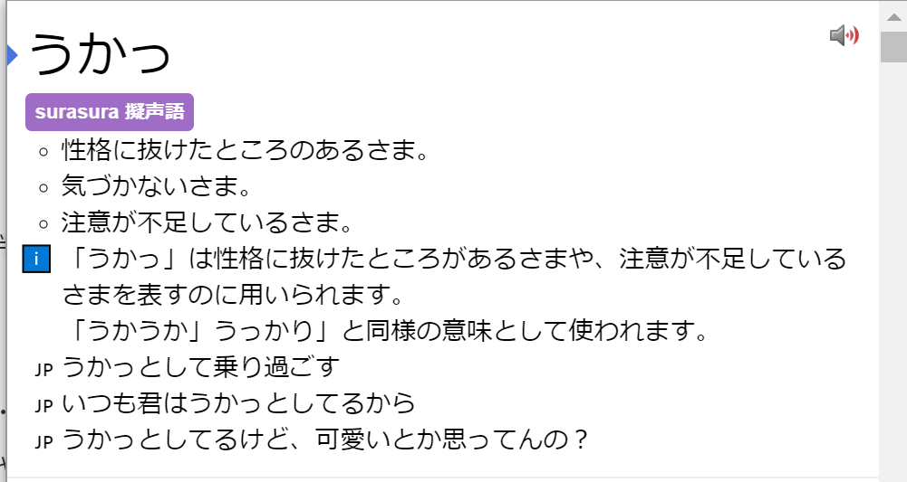
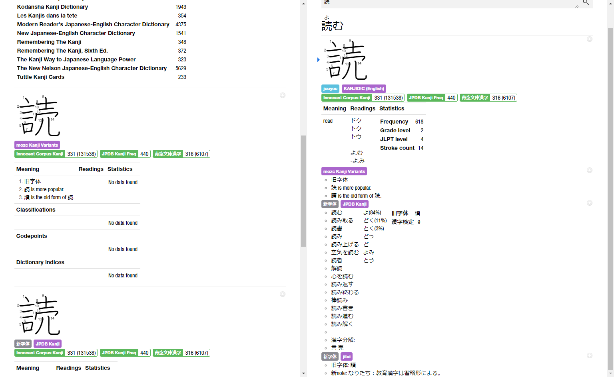
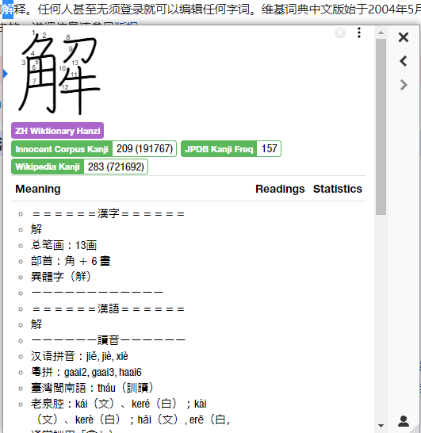
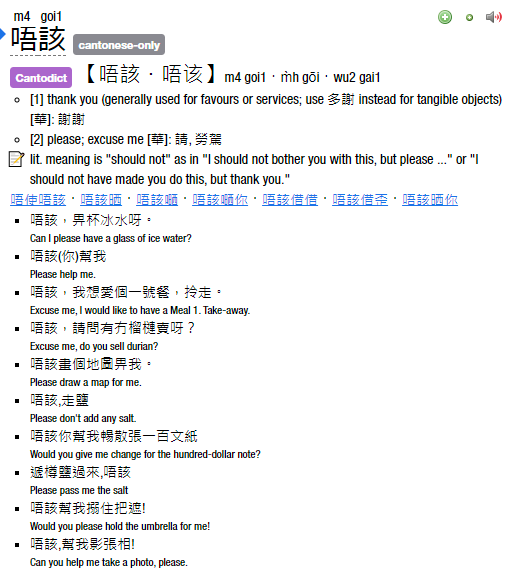
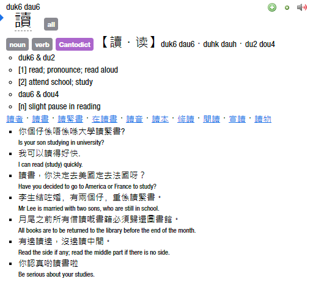
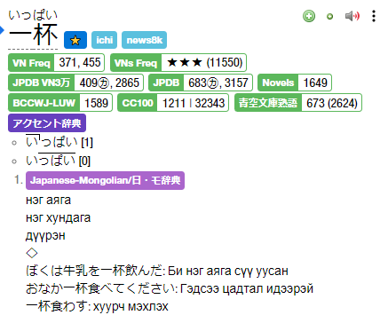

# Yomitan Dictionaries <!-- omit in toc -->

A comprehensive collection of Japanese and Chinese dictionaries for Yomitan (formerly Yomichan),
including terms, kanji/hanzi info, frequency, and variants with both monolingual and bilingual
dictionaries available.

This repository contains dictionaries for [Yomitan](https://github.com/themoeway/yomitan), a
Japanese dictionary browser extension for Chrome, Firefox, and Edge. The repository was originally
created to host the dictionaries I created, but I have since adapted this repository to serve as a
hub for other dictionaries as well. If you have a dictionary you would like to share, please open an
issue or pull request.

### **[Please check here for information on what dictionaries to install.](#dictionary-collection)** <!-- omit in toc -->

My related dictionary resources:

- [**How Do I Make A Yomichan Dictionary?**](how-to-make-yomichan-dictionaries.md)
- [**Yomitan Dictionary Stats**](https://github.com/MarvNC/yomitan-dict-stats) - Information such as
  metadata and entry counts for many Yomichan dictionaries.
- [**Yomichan Dictionary Builder**](https://github.com/MarvNC/yomichan-dict-builder/) - A node
  package I built to help with making dictionaries. It greatly simplifies the process of making
  dictionaries, please try it out if you use TypeScript or JavaScript.

### Table of Contents <!-- omit in toc -->

- [Dictionary Collection](#dictionary-collection)
  - [What Dictionaries Should I Install?](#what-dictionaries-should-i-install)
  - [Dictionaries Sort Script](#dictionaries-sort-script)
- [Japanese](#japanese)
  - [Terms](#terms)
    - [JP-EN Term Dictionaries](#jp-en-term-dictionaries)
    - [Japanese Monolingual Dictionaries](#japanese-monolingual-dictionaries)
    - [Grammar Dictionaries](#grammar-dictionaries)
    - [Term Frequency](#term-frequency)
  - [Kanji](#kanji)
    - [Yomichan CSS for Kanji Dictionaries](#yomichan-css-for-kanji-dictionaries)
    - [Kanji Info](#kanji-info)
    - [Kanji Variants](#kanji-variants)
    - [Kanji Frequency](#kanji-frequency)
- [Yomitan CSS for Non-Japanese CJK Languages](#yomitan-css-for-non-japanese-cjk-languages)
- [Mandarin Chinese](#mandarin-chinese)
  - [Mandarin Terms](#mandarin-terms)
    - [ZH-EN Term Dictionaries](#zh-en-term-dictionaries)
    - [ZH-JA Term Dictionaries](#zh-ja-term-dictionaries)
    - [ZH-ZH Term Dictionaries](#zh-zh-term-dictionaries)
    - [Chinese Frequency](#chinese-frequency)
  - [Hanzi](#hanzi)
- [Cantonese](#cantonese)
  - [Cantonese Terms](#cantonese-terms)
  - [Cantonese Term Frequency](#cantonese-term-frequency)
- [Japanese-German](#japanese-german)
- [Japanese-Portuguese](#japanese-portuguese)
- [French-Japanese](#french-japanese)
- [Other](#other)
  - [Indonesian-English](#indonesian-english)
  - [Japanese-Mongolian/日・モ辞典](#japanese-mongolian日モ辞典)
  - [Korean](#korean)
  - [Russian](#russian)
  - [Vietnamese-English](#vietnamese-english)
  - [Lao](#lao)
  - [Thai](#thai)
  - [English-English](#english-english)
    - [English-Japanese](#english-japanese)
  - [Arabic](#arabic)
  - [Converted Migaku Dictionaries](#converted-migaku-dictionaries)
  - [Other Languages](#other-languages)

# Dictionary Collection

**[Dictionaries Folder Download](https://drive.google.com/drive/folders/1LXMIOoaWASIntlx1w08njNU005lS5lez)**

**[Changelog](dict-changelog.md)**

Here is a folder containing all the Japanese, Mandarin, and Cantonese dictionaries that I personally
use and would recommend. If there is a dictionary in the folder that is outdated, please let me
know!

<!-- prettier-ignore -->
> [!TIP]
> - **But scrolling to the next entry takes too long!**
> - Here are some shortcuts that may help you with this:
>   - `alt + scroll down`
>   - `alt + pagedown`
>   - `alt + down arrow`

<!-- prettier-ignore -->
> [!IMPORTANT] 
> The collection is not complete as there are some dictionaries I feel are outdated or
> unnecessary or have simply chosen not to install. For these as well as older and alternate 
> versions of dictionaries, I recommend checking out
> [Shoui's Dictionary Collection](https://learnjapanese.moe/resources/#dictionaries).

## What Dictionaries Should I Install?

<!-- prettier-ignore -->
> [!TIP]
> **The Japanese Dictionaries Starter Pack consisting of these dictionaries in order 
> for easy download and import is now available in the 
> [Dictionaries Folder](https://drive.google.com/drive/folders/1LXMIOoaWASIntlx1w08njNU005lS5lez).**

If you're a beginner, I would say the _bare minimum_ to install from the
[dictionary collection](#dictionary-collection) is:

- Bilingual:
  - **[JA-EN] jitendex-yomitan**
  - **[JA-EN] 新和英**
- Names:
  - **[JA-JA Names] JMnedict**
- Grammar:
  - **[JA Grammar] dojg-consolidated-v1_01**
- Frequency:
  - **[JA Freq] JPDB_v2.1_kana_display_only**
  - **[JA Freq] jiten_freq_global**
  - **[JA Freq] Freq_CC100**
  - **[JA Freq] BCCWJ-LUW**
- Monolingual but still useful for coverage to a beginner! If a word shows up in one of these
  dictionaries but not an English one, you can just web search/translate to find out more
  information.
  - **[JA-JA] 小学館例解学習国語 第十二版** (best beginner mono dict, includes simple example
    sentences and furigana)
  - **[JA-JA] 大辞泉 第二版**
  - **[JA-JA] 実用日本語表現辞典**
  - **[JA-JA Encyclopedia] PixivLight**
- Beginner questions (these will answer the questions: what is the difference between these words
  with a similar meaning, or what does it mean when this word uses a different kanji than usual).
  - **[JA-JA Thesaurus] 使い方の分かる 類語例解辞典 [2024-05-02]**
  - **[JA-JA] 漢検漢字辞典　第二版**
- Kanji information
  - **[Kanji] KANJIDIC_english**
  - **[Kanji] JPDB Kanji**
- Pitch accent
  - **[Pitch] NHK2016**

Also see:

- [Kuri's Yomitan Setup](https://donkuri.github.io/learn-japanese/setup/#adding-dictionaries)
- [Shoui's Yomitan Setup](https://learnjapanese.moe/yomichan/)

My personal recommendation is to install everything. With every dictionary installed, you know that
any (actual) word you come across will almost certainly be in your Yomitan installation, and that
you will have a good selection of definitions for almost any word. Most dictionaries on their own do
not have that high of a breadth of coverage so having less dictionaries installed means you may run
into confusion when you fail to look up a word. Some of the dictionaries cover quite different
subject areas as well - hover a cultural reference and you will be more likely to find it in the
Pixiv dictionary than any other.

## Dictionaries Sort Script

If you install a lot of dictionaries and/or sync your dictionary collection across multiple devices,
it can be quite the ordeal to change the sort order with the way Yomitan's UI is set up. I have
written a script that will automatically sort your dictionaries for you. You can find it here:
[**Yomitan Dictionaries Sort Script for Yomitan**](https://raw.githubusercontent.com/MarvNC/yomichan-dictionaries/master/sort-dictionaries.js).

To use it, simply copy the script, open the Yomitan options page, open the console, paste the
script, and press enter. It will automatically sort your dictionaries for you.

By default, the sort order used is the one that I use and it supports all the dictionaries in the
folder. If you want to use a different sort order, you can edit the script to change the `order`
variable at the top.

# Japanese

For an easy download of the dictionaries I use, check out [this folder](#dictionary-collection).

Do check out [yomichan-dict-css](https://github.com/themoeway/yomichan-dict-css) for CSS that colors
some term dictionaries to make them more immediately distinguishable.


## Terms

### JP-EN Term Dictionaries

#### Jitendex

**[Jitendex](https://github.com/stephenmk/Jitendex)**

Jitendex is a free and openly licensed Japanese-to-English dictionary built upon data from JMdict
and other projects. It is the successor to JMdict for Yomichan.

#### JMDict

**[Download](https://github.com/MarvNC/jmdict-yomitan)**

The most extensive JP-EN dictionary using data from the
[EDRDG Project](https://www.edrdg.org/jmdict/j_jmdict.html) created by Jim Breen. It is recommended
you use Jitendex unless you need a legacy version of the dictionary for technical reasons.

#### JMnedict

**[Download](https://github.com/MarvNC/jmdict-yomitan)**

A dictionary of Japanese proper names. The linked version is advantageous over the one linked on the
Yomichan homepage as it clutters the search page much less when searching, so it's highly
recommended.

#### New Saitou Japanese-English Dictionary

Find `[JA-EN] NEW 斎藤和英大辞典` in the [dictionary collection](#dictionary-collection).

A bilingual dictionary by an anon, with lots of example sentences. You may want to limit the amount
of example sentences to avoid cluttering the search page by using the following CSS, where the
number 5 can be changed:

```css
[data-dictionary='NEW斎藤和英大辞典'] ul.gloss-sc-ul > li:nth-child(n + 5) {
  display: none;
}
```

#### Babylon Japanese-English

[peldas' Yomitan Dictionaries](https://github.com/peldas/yomitan-dicts?tab=readme-ov-file#japanese-english)

<details>
  <summary>Images</summary>


</details>

#### Onomatoproject

Find `[JA-EN Onomatopoeia] Onomatoproject` in the [dictionary collection](#dictionary-collection).

Onomatopoeia converted by Malte from https://onomatoproject.com/.

<details>

<summary>Images</summary>


</details>

### Japanese Monolingual Dictionaries

Found in the [dictionary collection](#dictionary-collection).

- 広辞苑 第七版
  - Converted by [Thermosphere and shoui](https://github.com/Thermospore/koj72yomi).
- 三省堂国語辞典　第七版
- 現代新国語辞典　第七版
  - Converted by [Zenon](https://drive.google.com/drive/folders/1pkf3Au9zfOMiZITNVtz-nnRfNW5XzC5q). Contains 82620 term entries (75615 words, 7005 phrases), 2136 kanji entries.
- 実用日本語表現辞典
- 新明解国語辞典 第七版
- 明鏡国語辞典 第三版
<details>
<summary>Converted by Caoimhe.</summary>


</details>

- 旺文社国語辞典 第十二版
<details>
<summary>Converted by Caoimhe.</summary>


</details>

- 三省堂 全訳読解古語辞典
<details>
<summary>Converted by Caoimhe.</summary>


</details>

- 旺文社 全訳古語辞典
<details>
<summary>Converted by Caoimhe.</summary>


</details>

- Weblio 古語辞典
  - Scraped/converted by 昔男/mk68.
- 精選版 日本国語大辞典
- 明鏡国語辞典
- 旺文社国語辞典 第十一版 画像無し
- 新明解国語辞典 第五版
- 故事ことわざの辞典
  - Converted by Thermosphere with Yomichan Import
- 広辞苑 第六版
- 岩波国語辞典 第六版
- 大辞林 第三版
- ハイブリッド新辞林 v2
- デジタル大辞泉 (Updated ver.)
<details>
<summary>Converted by Caoimhe.</summary>


</details>

- 新明解四字熟語辞典
  - Converted by ッツ.
- 学研 四字熟語辞典
  - Converted by ッツ.
- 日本語俗語辞書
  - Scraped/converted by Kartoffel.
- 旺文社漢字典 第四版
<details>
<summary>Converted by Caoimhe.</summary>


</details>

- 角川新字源
<details>
<summary>Converted by Caoimhe.</summary>


</details>

- 漢字源

#### ixodid dictionary collection

A curated collection of Japanese-Japanese, kanji, encyclopedia, and specialized Yomitan dictionaries converted from FreeMDict MDX files.

- **[ixodid Yomitan Dictionaries folder](https://drive.google.com/drive/folders/1rTtDHxY9vRh4DCeZ1lnYhLiypeM5OviI)**

**Included Dictionaries**

- 全訳漢辞海 第四版 (improved conversion)
- 大修館新全訳古語辞典
- 大修館 日本語シソーラス類語検索辞典［第二版］
- 字通［普及版］ (mapped gaiji)
- 学研全訳古語辞典［第一版］
- 学研 新世紀ビジュアル大辞典
- 学研漢和大字典
- 小学館の図鑑NEO (動物, 昆虫, 魚, 鳥)
- 小学館 日本大百科全書（ニッポニカ）
- 故事俗信ことわざ大辞典［第二版］
- 新漢語林 第二版
- 新選漢和辞典
- 旺文社 オーレックス和英辞典 第2版
- 旺文社古語辞典［第十一版］
- 旺文社標準国語辞典［第八版］
- 旺文社標準漢和辞典［第七版］
- 朝日出版社 最新日米口語辞典［決定版］
- 漢検四字熟語辞典［第二版］
- 研究社 日本語口語表現辞典［第二版］
- 研究社 日本語複合動詞活用辞典
- 精選版 日本国語大辞典 (improved conversion)
- 角川古語大辞典
- 講談社 日本語大辞典 第二版
- 講談社 日本語大辞典 第二版 双解版 (jp + zh defs)

#### Caoimhe's dictionaries

Dictionaries converted by Caoimhe.

- **[Caoimhe Yomitan Dictionaries folder](https://drive.proton.me/urls/GH0GV6DMEC#RP55zc2DL8vD)**

**例解学習国語辞典 第十二版**

Converted by Caoimhe. Data from Monokakido. Include as well images, 筆順 etc... Great for
semi-beginners.

<details>

<summary>Images</summary>


</details>

**有斐閣法律用語辞典 第５版**

Converted by Caoimhe. Data from Monokakido. 14711 entries.

<details>

<summary>Images</summary>


</details>

**南山堂医学大辞典 第 20 版**

Converted by Caoimhe. Data from Monokakido. 39087 entries.

<details>

<summary>Images</summary>


</details>

**現代心理学辞典**

Converted by Caoimhe. Data from Monokakido. 10223 entries.

<details>

<summary>Images</summary>


</details>

#### Salwynn's dictionaries

Dictionaries converted by Salwynn.

- **[Salwynn Yomitan Dictionaries folder](https://drive.google.com/drive/folders/1CPPAgKzz_PDEb7JUPHGioONTEQg0aCHW)**

**語彙力・熟語の百科事典**

Jukugo and expressions with images from https://proverb-encyclopedia.com/dictionary/,
https://proverb-encyclopedia.com/two/, https://proverb-encyclopedia.com/two/douonigigo-itiran/,
https://sanji-jukugo.com/ and https://yoji-jukugo.com/

<details>

<summary>Images</summary>


</details>

**四字熟語の百科事典**

Yojis and images from https://idiom-encyclopedia.com/ (includes 三字熟語 as well)

<details>

<summary>Images</summary>


</details>

**ことわざ・慣用句の百科事典**

Includes images, data from https://proverb-encyclopedia.com/

<details>

<summary>Images</summary>


</details>

**絵でわかる慣用句**

From 絵でわかる慣用句 at https://kaku-navi.com/ which includes cute manga strips explaining things
along with text explanations. Updates daily.

<details>

<summary>Images</summary>


</details>

**ネット用語辞典「ネット王子」**

Data from https://netyougo.com/. It focuses on forum culture (like [2ch](https://2ch.sc/)), tweets,
popular phrases, and what was trending at the time. (5488 entries)

<details>

<summary>Images</summary>


</details>

**形容詞・動詞のイラスト素材辞典**

Pictures scraped from Bing Images (exclusive verbs, adj-i with single kanji) (10,167 枚 for 3162
entries)

<details>

<summary>Images</summary>


</details>

**用例.jp**

10 preview examples of entries from Jmdict that are tagged with [ichi1], [gai1], [news1], [spec1],
or [spec2], on [yourei.jp](https://yourei.jp/) excluding anything that doesn’t relate to a common
noun. 20932 entries.

<details>

<summary>Salwynn's Note/Images</summary>

> I think it offers more context and example sentences than some monolingual dictionaries, which
> don’t always provide them—or only offer a few of the most ‘representative’ ones.


</details>

**ウェブ検索\_Light**

Look up term's pictures faster on web.

<details>

<summary>Salwynn's Note/Images</summary>

> Make sure to enable Link Preview to have these pop-ups


</details>

**きっずジャポニカ 新版**

Kids' Japonica converted by Salwynn.

<details>

<summary>Images</summary>


</details>

**ポケモン図鑑**

Pokemon images from https://zukan.pokemon.co.jp/

<details>

<summary>Images</summary>


</details>

**TMW Club**

1,924 images from a few hundred food images collected from the web by TMW's cooking club and flowers
from Anki deck.

<details>

<summary>Images</summary>


</details>

**全市区町村辞典**

2,307 Japanese city images.

<details>

<summary>Images</summary>


</details>

#### Iwanami Kokugo Jiten

Find `[JA-JA] 岩波国語辞典 第八版` in the [dictionary collection](#dictionary-collection).

A monolingual dictionary made by an anon, with very nice formatting and links for related terms.

<details>
  <summary>Images</summary>


</details>

#### Jitenon Dictionaries

Find them in the [dictionary collection](#dictionary-collection).

There are many dictionaries available at [辞典オンライン](https://jitenon.jp/) and
[using stephenmk's jitenbot](https://github.com/stephenmk/jitenbot), some of these have been scraped
for use as Yomichan dictionaries. There are quite a few entries that aren't in other dictionaries,
so I'd recommend installing this.

Includes the following dictionaries:

- [四字熟語辞典オンライン](https://yoji.jitenon.jp/)
- [故事・ことわざ・慣用句オンライン](https://kotowaza.jitenon.jp/)
- [国語辞典オンライン](https://kokugo.jitenon.jp/)

<details>
  <summary>Images (click to expand)</summary>


</details>

#### Sankoku Eighth Edition

**[三省堂国語辞典　第八版](https://www.mediafire.com/file/1quamrofz1ldbp1/%25E4%25B8%2589%25E7%259C%2581%25E5%25A0%2582%25E5%259B%25BD%25E8%25AA%259E%25E8%25BE%259E%25E5%2585%25B8%25E3%2580%2580%25E7%25AC%25AC%25E5%2585%25AB%25E7%2589%2588.zip/file)**

Converted by Malte using [stephenmk's jitenbot](https://github.com/stephenmk/jitenbot).

#### Daijirin Fourth Edition

**[大辞林第四版](https://www.mediafire.com/file/opc4m5hmycljkcb/%25E5%25A4%25A7%25E8%25BE%259E%25E6%259E%2597%25E3%2580%2580%25E7%25AC%25AC%25E5%259B%259B%25E7%2589%2588.zip/file)
|
[大辞林第四版　画像無し](https://www.mediafire.com/file/a94y4d0xefg2ilf/%25E5%25A4%25A7%25E8%25BE%259E%25E6%259E%2597%25E3%2580%2580%25E7%25AC%25AC%25E5%259B%259B%25E7%2589%2588%25E3%2580%2580%25E7%2594%25BB%25E5%2583%258F%25E7%2584%25A1%25E3%2581%2597.zip/file)**

Converted by Malte using [stephenmk's jitenbot](https://github.com/stephenmk/jitenbot).

#### Shinmeikai Eighth Edition

**[新明解第八版](https://www.mediafire.com/file/pgzai40a38hpflc/%25E6%2596%25B0%25E6%2598%258E%25E8%25A7%25A3%25E5%259B%25BD%25E8%25AA%259E%25E8%25BE%259E%25E5%2585%25B8%25E3%2580%2580%25E7%25AC%25AC%25E5%2585%25AB%25E7%2589%2588.zip/file)**

Converted by Malte using [stephenmk's jitenbot](https://github.com/stephenmk/jitenbot).

#### Meikyou Second Edition

Find `[JA-JA] 明鏡国語辞典 第二版` in the [dictionary collection](#dictionary-collection).

Converted by dictionary anon, this dictionary has nice modern formatting.

<details>
  <summary>Images (click to expand)</summary>


</details>

#### Shinsenkoku Tenth Edition

Find `[JA-JA] 新選国語辞典 第十版` in the [dictionary collection](#dictionary-collection).

Converted by dictionary anon, this dictionary has nice modern formatting.

Recommended custom CSS:

```css
li[data-dictionary^='新選国語辞典'] th,
span[data-sc-shinsenkoku10='warichu'] {
  white-space: nowrap;
}
span[data-sc-shinsenkoku10='red'] {
  color: #e5007f;
}
```

<details>
  <summary>Images (click to expand)</summary>


</details>

#### Goo Thesaurus

Find `[JA-JA Thesaurus] 使い方の分かる 類語例解辞典 [2024-05-02]` in the
[dictionary collection](#dictionary-collection).

(Updated 2024-05-04) Scraped by Malte from the online
[goo.ne thesaurus](https://dictionary.goo.ne.jp/thsrs/). Screenshots: https://imgur.com/a/uDT81BI

#### Goo Dialect Dictionary

**[全国方言辞典](https://www.mediafire.com/file/at8jg58kwjiilw9/%25E5%2585%25A8%25E5%259B%25BD%25E6%2596%25B9%25E8%25A8%2580%25E8%25BE%259E%25E5%2585%25B8.zip/file)**

Scraped by Malte from the online [goo.ne dialect dictionary](https://dictionary.goo.ne.jp/dialect/).

<!-- prettier-ignore -->
> [!NOTE] 
> Note: This version has some (~650) entries formatted like そーだ instead of そうだ which
> can be annoying.

#### 新語時事用語辞典

**[新語時事用語辞典](https://www.mediafire.com/file/a89vdraxh2albod/%25E6%2596%25B0%25E8%25AA%259E%25E6%2599%2582%25E4%25BA%258B%25E7%2594%25A8%25E8%25AA%259E%25E8%25BE%259E%25E5%2585%25B8.zip/file)**

Scraped from http://www.breaking-news-words.com/ by Malte.

> 「新語時事用語辞典」は、ニュースで今最も話題になっている最新のキーワードを時流に即して紹介する、速報・辞書サイトです。新聞で、テレビで、ネットで話題になっているキーワードや流行語をいち早く紹介します。

#### 実用日本語表現辞典

**[実用日本語表現辞典](https://www.mediafire.com/file/hw2gkzfyddtdzje/%25E5%25AE%259F%25E7%2594%25A8%25E6%2597%25A5%25E6%259C%25AC%25E8%25AA%259E%25E8%25A1%25A8%25E7%258F%25BE%25E8%25BE%259E%25E5%2585%25B8.zip/file)**

Scraped from http://www.practical-japanese.com/ by Malte. Updated version of the old yomichan
dictionary.

#### Kanjipedia 同訓異義

[Kanjipedia 同訓異義](https://www.mediafire.com/file/ltnvo3f5ipmr289/%E6%BC%A2%E5%AD%97%E3%83%9A%E3%83%87%E3%82%A3%E3%82%A2%E5%90%8C%E8%A8%93%E7%95%B0%E7%BE%A9.zip/file)

Scraped by Julian and converted by Malte, sourced from
[Kanjipedia](https://www.kanjipedia.jp/sakuin/doukunigi/).

This dictionary differentiates the usages of words with the same reading but different kanji, for
example 越える・超える・逾える・踰える.

#### 漢検漢字辞典　第二版 Kanken Kanji Jiten 2nd Edition

**[Download](https://files.catbox.moe/pnobup.zip)** (Updated 2024-03-04)

The 漢検漢字辞典　第二版 Kanken Kanji Jiten 2nd Edition is a kanji dictionary made by the
[日本漢字能力検定協会](https://www.kanken.or.jp/) (Japanese Kanji Aptitude Test Association). It was
converted by dictionary anonymous into a Yomitan dictionary.

<!-- prettier-ignore -->
> [!NOTE] 
> This dictionary will not work on outdated Yomitan/Yomichan/Yomibaba installations as it
> utilizes new additions to the schema. Please install Yomitan 23.12.29 or newer.

<details>
  <summary>(Click to expand) Images</summary>


</details>

#### JA Wikipedia

**[Wikipedia for Yomitan](https://github.com/MarvNC/wikipedia-yomitan)**

A conversion of the [DBPedia](https://dbpedia.org/) short-abstract dumps of
[JA Wikipedia](https://ja.wikipedia.org/) for Yomitan. This dictionary features over 1.2 million
entries with each entry containing the abstract and a link to the Wikipedia article. Unfortunately
there are no dumps of DBPedia after December 2022, so regular updates will not be possible until
DBPedia starts updating again.

#### Pixiv

**[Pixiv for Yomitan](https://github.com/MarvNC/pixiv-yomitan)**

**Last Updated: 2024-02**

A complete scrape of the public [dic.pixiv.net](https://dic.pixiv.net/) encyclopedia of over 500,000
entries, containing a brief summary and links to related articles for each entry. This dictionary is
quite extensive and contains entries for a vast amount of terms that would not be in traditional
dictionaries. For instance, 和泉妃愛 has an entry as does likely every notable VTuber, media
franchise, and mountain in Japan.

#### niconico-pixiv Terms

<details>
<summary>Click to expand (obsolete)</summary>

**[Download](https://github.com/MarvNC/yomichan-dictionaries/raw/master/dl/%5BOther%5D%20Nico-Pixiv.zip)**

Using the information
[gathered by ncaq for use in an IME](https://github.com/ncaq/dic-nico-intersection-pixiv), this is a
dictionary that can help parse terms that are in **both** [niconico](https://dic.nicovideo.jp/) and
[pixiv](https://dic.pixiv.net/)'s online dictionaries. These online dictionaries are sort of like
encyclopedias of the internet, so many terms such as proper nouns not in traditional dictionaries
will be found.

> ルールベースで IME 辞書の役に立たなそうな単語を除外しています。

%E3%81%A8%E3%81%AF%E3%80%90%E3%83%94%E3%82%AF%E3%82%B7%E3%83%96%E7%99%BE%E7%A7%91%E4%BA%8B%E5%85%B8%E3%80%91_-_httpsdic.pixiv.net_2022-08-21_17-22-10.png>)

</details>

#### surasura Onomatopoeia

**[Download](https://github.com/MarvNC/yomichan-dictionaries/raw/master/dl/%5BMonolingual%5D%20surasura.zip)**

A dictionary of onomatopoeia from [surasura.com](http://sura-sura.com/). Contains some onomatopoeia
that are not in any other dictionaries. Credit to [stephenmk](https://github.com/stephenmk) for the
idea to mark information using those emojis with his
[improved JMDict](https://github.com/FooSoft/yomichan-import/pull/40).

For each entry, it contains:

- A few definitions
- An extended explanation if available, marked with the ℹ️ emoji
- A few example sentences marked with the 🇯🇵 flag emoji



#### 複合語起源 Term Origins

**[Download](https://github.com/MarvNC/yomichan-dictionaries/raw/master/dl/%5BOther%5D%20%E8%A4%87%E5%90%88%E8%AA%9E%E8%B5%B7%E6%BA%90.zip)**
| **[List of words](./japanese/term/termOrigins/%E8%A4%87%E5%90%88%E8%AA%9E%E8%B5%B7%E6%BA%90.tsv)**

Compound kunyomi word origins/etymology, for example 陥る -> 落ち入る（おち|いる）. Information
comes from anonymous forum posts, so it may not be 100% accurate.


**Sources:**

- [shitaraba](https://jbbs.shitaraba.net/bbs/read.cgi/study/10958/1299762655/)
- [5ch](https://academy6.5ch.net/test/read.cgi/gengo/1228873581/)
- [Wanikani](https://community.wanikani.com/t/special-kanji-words-derived-from-other-words/35655)

#### Gogen Yurai

Find `[JA-JA Origins] 語源由来辞典` in the [dictionary collection](#dictionary-collection).

語源由来辞典 etymology information parsed from https://gogen-yurai.jp/ by Seikou. Contains
information about the origins of words.

#### 対義語辞典オンライン Taigigo Jiten Online

Find `[JA-JA Antonyms] 対義語辞典オンライン [2024-04-30]` in the
[dictionary collection](#dictionary-collection).

A dictionary of antonyms from [対義語・反対語辞典オンライン](https://taigigo.jitenon.jp/), converted
by 霜月.

#### 類語辞典オンライン Ruigo Jiten Online

Find `[JA-JA Thesaurus] 類語辞典オンライン (2024-02-09)` in the
[dictionary collection](#dictionary-collection).

A dictionary of synonyms from [類語辞典オンライン](https://ruigo.jitenon.jp/), converted by 霜月.

<details>

<summary>Image (click to expand)</summary>


</details>

#### 数え方辞典オンライン Kazoekata Jiten Online

Find `[JA-JA Counters] 数え方辞典オンライン (2024-02-13)` in the
[dictionary collection](#dictionary-collection).

A dictionary of counters from [数え方辞典オンライン](https://count.jitenon.jp/), converted by 霜月.

<details>

<summary>Image (click to expand)</summary>


</details>

#### 現代国語例解辞典　第五版 Gendai Kokugo Reikai Jiten

Find `[JA-JA] 現代国語例解辞典 第五版` in the [dictionary collection](#dictionary-collection).

- Has hundreds of tables and charts for explaining usage contexts of similar words
- Has many entries for onomatopoeia / mimetic words that are grouped by similar meanings

Converted by DAnon

<details>

<summary>Images/stats (click to expand)</summary>

- 62,873 vocabulary entries
- 1,356 慣用句 entries
- 276 助詞・助動詞 entries
- 82 擬音語・擬態語 categories containing 1,138 subentries
- 2,787 kanji entries


</details>

#### Kanji de Go

**[Kanji de Go for Yomitan](https://github.com/MarvNC/kanjidego-yomitan-anki)**

[Kanji de Go (漢字で Go!)](https://plicy.net/GamePlay/155561) is a fun game quizzing people on
rare/exotic kanji terms. Converted by Marv.

#### 擬音語・擬態語辞典

Onomatopoeia dictionary contributed by [dubai03nsr](https://github.com/dubai03nsr).

[See more details and download here](https://github.com/MarvNC/yomitan-dictionaries/issues/83) or
from the dictionary collection.

> This lightweight dictionary specializes on mimetic words, offering a depth beyond that of normal
> dictionaries. The example sentences tend to be more fleshed out and from relatively modern texts.
> The entries include extensive comparison with related words.

#### JA Wikipedia Proper Nouns

[Project Page](https://github.com/J-O-S-H-L/JP-Proper-Noun-Dictionary?tab=readme-ov-file)

Proper nouns from JA Wikipedia.

#### Living Japanese Slang

**[Living_Japanese_Slang_Dictionary_Scripting_Japan.zip](https://github.com/user-attachments/files/21926553/Living_Japanese_Slang_Dictionary_Scripting_Japan.zip)**

Created by
[scriptingjapan](https://wesleycrobertson.wordpress.com/2022/06/19/living-japanese-slang-dictionary/)
and converted by Selxo, just some slangs explained in English. Relatively small dictionary with 636
entries.

<details>

<summary>Images</summary>


</details>

### Grammar Dictionaries

#### aiko-tanaka Grammar Dictionaries

**[Download](https://github.com/aiko-tanaka/Grammar-Dictionaries)**

A collection of grammar dictionaries scraped and converted by aiko-tanaka. A lot of manual work was
put in to creating them to make them parse well, I'd recommend you install all of them. Contains:

- Nihongo no sensei 毎日のんびり日本語教師
- E de wakaru 絵でわかる日本語
- Nihongo Kyoshi JLPT 文法解説まとめ
- Donna Toki どんなときどう使う 日本語表現文型辞典
- DoJG 日本語文法辞典(全集)

**Updated 絵でわかる日本語**

Salwynn added images to this dictionary from the original site. Can be found in
[Salwynn's collection](#salwynns-dictionaries) or the [main collection](#dictionary-collection).

#### Nihongo-Bunkei-Bank 日本語文型バンク

[Project Homepage](https://github.com/W1ght/ninjal-bunkei-yomitan)

#### Nihongo-Bunkei-Jiten 日本語文型辞典

[Project Homepage](https://github.com/HuangAntimony/Nihongo-Bunkei-Jiten)

#### Bunpro Grammar

[Project Homepage](https://github.com/J-O-S-H-L/grammar_dict)

Bunpro JA-EN grammar dictionary.

Found in the [dictionary collection](#dictionary-collection).

### Term Frequency

#### Kuuube's Frequency Dictionaries

**[Kuuube's Dictionaries](https://github.com/Kuuuube/yomitan-dictionaries)**

Yomitan dictionaries converted by [Kuuube](https://github.com/Kuuuube/).

Includes:

- **JPDB v2.1 Frequency** (updated May 2024)
- **BCCWJ SUW LUW Combined** - so you can just install this one
- **H Frequency** - Voice work scripts, small corpus
- **JMdict Frequency** - From JMdict's news frequency tags, not recommended

#### Jiten

**[Homepage](https://jiten.moe/other)**

Frequency dictionaries based on the corpus available at [jiten.moe](https://jiten.moe/), created by
the site owner. Jiten.moe is a site providing stats on lots of Japanese media, providing anki decks
and vocab lists.

#### jpdb Frequency Dictionary

<details>

<summary>Click to expand (made obsolete by Kuuube's version)</summary>

**[Download](https://github.com/MarvNC/jpdb-freq-list/releases)**

A frequency dictionary based on information scraped from https://jpdb.io in May of 2022. More
information can be found [here](https://github.com/MarvNC/jpdb-freq-list).

Due to the way the data was scraped, some terms are missing frequencies and the jpdb dictionary
itself is limited to terms in JMDict. For example, 経緯 only has an entry for the いきさつ reading
so it should not be used as a dictionary for sorting (the more common/correct reading is けいい).
However, the corpus of JPDB is quite good for immersion learners as it covers anime, dramas, light
novels, visual novels, and web novels so the frequencies will be relatively accurate to what you're
actually reading. This dictionary is notable for displaying the frequencies of kana readings
separately, so you can often get a sense of how often a word is written with kanji or not.

</details>

#### Aozora Bunko Jukugo Frequency

**[Download](https://github.com/MarvNC/yomichan-dictionaries/raw/master/dl/%5BFreq%5D%20Aozora%20Bunko.zip)**

A frequency dictionary created using data
[collected by vrtm](https://vtrm.net/japanese/kanji-jukugo-frequency/en) based on the
[Aozora Bunko](https://www.aozora.gr.jp/). Due to the
[methodology used](https://vtrm.net/japanese/kanji-jukugo-frequency/en), this dictionary does not
cover words with kana in them but it covers many rare 熟語 not covered by other frequency
dictionaries, such as 睽乖. The number in parentheses is the number of times the word appears in the
corpus.

#### CC100

Find `[JA Freq] Freq_CC100` in the [dictionary collection](#dictionary-collection).

Made by the mind behind [arujisho](https://github.com/emc2314/arujisho), this uses the
[CC100 dataset](https://data.statmt.org/cc-100/) which was made by crawling the web. Coverage is
very wide, and there is reason behind the way readings are differentiated which is why I use this as
my Yomichan sort dictionary.

<details>
<summary>Original message by Seikou</summary>

> Hello everyone! Recently I tokenized the [CC-100](https://data.statmt.org/cc-100/) Japanese
> dataset (which is a high quality dataset filtered from Commoncrawl web crawl data, and is about
> 70GB large) as a corpus using mecab(fugashi) and sudachi, resulting a frequency rank list of about
> 900k words. After filtering it using several monolingual dictionaries, I got a freq rank list of
> roughly 160k words.

</details>

#### BCCWJ

<details>

<summary>Click to expand (made obsolete by Kuuube's version)</summary>

**[Download](https://github.com/toasted-nutbread/yomichan-bccwj-frequency-dictionary/releases)**

From the [publication](https://link.springer.com/article/10.1007/s10579-013-9261-0):

> The balanced corpus of contemporary written Japanese (BCCWJ) is Japan’s first 100 million words
> balanced corpus. It consists of three subcorpora (publication subcorpus, library subcorpus, and
> special-purpose subcorpus) and covers a wide range of text registers including books in general,
> magazines, newspapers, governmental white papers, best-selling books, an internet bulletin-board,
> a blog, school textbooks, minutes of the national diet, publicity newsletters of local
> governments, laws, and poetry verses.

It has extremely wide coverage with most terms you'll encounter having an entry in this list even if
other frequency lists don't. In addition, it differentiates between readings quite well. Make sure
to install the LUW version as it has more terms.

</details>

#### Innocent Ranked

**[Download](https://learnjapanese.moe/resources/#dictionaries)**

The Innocent Corpus from the [Yomichan page](https://github.com/themoeway/yomitan/#dictionaries) but
reordered to be sorted by rank. It is based on data
[from 5000+ novels](https://web.archive.org/web/20190309073023/https://forum.koohii.com/thread-9459.html#pid168613).
A weakness is that it does not differentiate based on reading, so all readings of a term will show
the same value.

#### jpDicts Frequencies

**[Download](https://files.catbox.moe/1nip86.zip)**

A frequency dictionary created using monolingual dictionary definitions as the corpus, so it might
be useful for those who really like reading dictionaries. Made by Avratzzz.

<details>
<summary>Dictionaries used:</summary>

- ハイブリッド新辞林 v2
- 故事ことわざの辞典
- 漢字源
- 精選版 日本国語大辞典
- 新明解四字熟語辞典
- 学研 四字熟語辞典
- 実用日本語表現辞典
- 明鏡国語辞典
- 旺文社国語辞典 第十一版
- 新明解国語辞典 第五版
- 大辞林 第三版
- デジタル大辞泉
- 岩波国語辞典 第六版
- 広辞苑 第六版

</details>

#### Youtube Frequency Dictionaries

Find `[JA Freq] YoutubeFreqV3` in the [dictionary collection](#dictionary-collection).

**[Download all domain-specific dictionaries](https://files.catbox.moe/1nip86.zip)**

> Using data from 40k manually transcribed YouTube videos we have created 16 domain specific
> frequency lists for YomiChan. Enjoy and feel free to share around. Created by @Zetta @Vexxed
> @Anonymous

Domain-specific frequency lists from Youtube Videos:

<details>
<summary>Domains:</summary>

- Vlogs
- Vehicles
- Travel
- TEDx
- Sports
- SciTech
- Pets/Animals
- Nonprofits
- News
- Music
- HowtoStyle
- Gaming
- Film/Anime
- Entertainment
- Education
- Comedy

</details>

#### Corpus of Everyday Japanese Conversation

**[Download](https://github.com/forsakeninfinity/CEJC_yomichan_freq_dict)**

<!-- prettier-ignore -->
> [!IMPORTANT] 
> Due to the limited nature of the original data set, this frequency list only goes up
> to around 20,000 in frequency. It is still useful to know the relative frequency of words in
> conversation, but the frequency values should not be compared to those from other more expansive
> frequency dictionaries. For a more complete list that is somewhat conversational, I recommend
> trying the Youtube frequency list.

This Yomichan frequency dictionary based on the
[Corpus of Everyday Japanese Conversation](https://www.ninjal.ac.jp/english/research/cr-project/project-3/institute/spoken-language/)
was converted by forsakeninfinity.

> The Corpus of Everyday Japanese Conversation (CEJC) is a vocabulary and word count table based on
> 200 hours of recorded data (approximately from April 2016 to 2020).

> Our project will develop a large-scale corpus of Japanese everyday conversation in a balanced
> manner. Since informants record their conversations in everyday situations by themselves,
> naturally occurring conversations can be collected. To build an empirical foundation for the
> corpus design, we conducted a survey of ordinary conversational behavior of about 250 adults."\

#### Corpus of Spontaneous Japanese

**[Find it here](https://github.com/Maltesaa/CSJ_and_NWJC_yomitan_freq_dict)**

Converted by Malte, “The Corpus of Spontaneous Japanese” (or CSJ) is a database containing a large
collection of Japanese spoken language data and information for use in linguistic research; jointly
developed by NINJAL, NICT and the Tokyo Institute of Technology, the CSJ is world-class in both the
quantity and quality of the available data. Goes up to 31,605 frequency.

#### NINJAL Web Japanese Corpus

**[Find it here](https://github.com/Maltesaa/CSJ_and_NWJC_yomitan_freq_dict)**

Converted by Malte. Goes up to 106,762 frequency.

#### Shoui Dictionaries Collection Misc. Frequency Dictionaries

Some other miscellaneous frequency dictionaries in the
[Shoui Dictionaries Collection](https://learnjapanese.moe/resources/#dictionaries).

- Anime & J-drama
- [Narou](http://wiki.wareya.moe/Narou) Freq
- Novels
- VN Freq v2
- Wikipedia v2
- 国語辞典
- Nier

#### OhTalkWho オタク Frequency Dictionaries

**[Download](https://docs.google.com/document/d/1IUWkvBxhoazBSTyRbdyRVk7hfKE51yorE86DCRNQVuw/edit)**

Some frequency dictionaries made by this YouTuber
[OhTalkWho オタク](https://www.youtube.com/watch?v=DwJWld8hW0M).

- Netflix
- Top 100 Shonen
- Top 100 Slice of Life
- JLPT Level Tags
- Novel 5k
  - This might just be innocent corpus with stars?
- Visual Novels
  - Might be based off [vnstats](http://wiki.wareya.moe/)? It's different than the VN Freq v2 in
    Shoui's Dictionaries Collection.

#### Anacreon's Frequency Dictionaries

**[Download](https://anacreondjt.gitlab.io/docs/freq/)**

Some frequency dictionaries made by Anacreon that are not rank-based, but rather percentage-based
where the displayed value is the percent of that corpus you would be able to read if you knew every
word with that percentage or lower. They are somewhat redundant with other previously mentioned
dictionaries, but some people may prefer the percentage-based approach.

> Frequency is displayed as a number between MOST frequent 0 and LEAST frequent 100. Check out this
> graph, essentially the number in these dicts are the Y axis of
> [this graph](https://anacreondjt.gitlab.io/img/graph.png). So if you were aiming for understanding
> 95% of words you come across the most efficient way would be to mine all the words with a freq
> less than or equal 95.

- Visual Novels (from [vnstats](http://wiki.wareya.moe/))
- [Narou](http://wiki.wareya.moe/Narou)
- BCCWJ2

#### JLPT Vocab Frequency

**[yomichan-jlpt-vocab](https://github.com/stephenmk/yomichan-jlpt-vocab)**

A frequency dictionary based on unofficial JLPT lists from ten years ago. There are no official
vocab lists for the JLPT exam so the numbers in this list should only be used as a guideline.

## Kanji

### Yomichan CSS for Kanji Dictionaries

Yomichan and KANJIDIC by default have a lot of bloat in the kanji dictionary viewer, like repeating
the kanji stroke order image, frequency information, and unused table rows for every entry. For
using multiple kanji dictionaries, you can use some CSS to make the kanji display more compact like
it is for terms.



In `Settings -> Popup Appearance -> Configure custom CSS...` input the following CSS for more
compact display of entries.

```css
/* remove misc dict classifications/codepoints/stats */
.kanji-glyph-table > tbody > tr:nth-child(n + 3) {
  display: none;
}

/* remove stroke diagram, freq, header for next entries */
div.entry[data-type='kanji']:nth-child(n + 2) .kanji-glyph-container,
div.entry[data-type='kanji']:nth-child(n + 2) [data-section-type='frequencies'],
div.entry[data-type='kanji']:nth-child(n + 2) table.kanji-glyph-table > tbody > tr:first-child {
  display: none;
}

/* remove 'No data found' */
.kanji-info-table-item-value-empty {
  display: none;
}

/* reduce extra padding */
.kanji-glyph-table,
div.entry[data-type='kanji'],
div.entry[data-type='kanji']:nth-child(n + 2) .kanji-glyph-table > tbody > tr > *,
.kanji-glyph-table dl.kanji-readings-japanese,
div.entry[data-type='kanji']:nth-child(n + 2)
  .kanji-glyph-table
  dl.kanji-readings-chinese[data-count='0'] {
  padding-top: 0 !important;
  padding-bottom: 0 !important;
  margin-bottom: 0em;
  margin-top: 0 !important;
}
/* remove horizontal lines */
.entry + .entry[data-type='kanji'],
div#dictionary-entries > div.entry:nth-child(n + 2) .kanji-glyph-table > tbody > tr > * {
  border-top: none !important;
}
/* change decimal list */
.kanji-gloss-list {
  list-style-type: circle;
}
```

### Kanji Info

#### KANJIDIC

**[Download](https://github.com/MarvNC/jmdict-yomitan)**

The [KANJIDIC Project](http://www.edrdg.org/wiki/index.php/KANJIDIC_Project)'s KANJIDIC is the
primary English kanji dictionary used in Yomichan and contains information about most kanji, notably
English definitions, readings, and some other statistics like stroke count, JLPT, grade level.

#### Wiktionary Kanji

**[Download](https://github.com/MarvNC/yomichan-dictionaries/raw/master/dl/%5BKanji%5D%20Wiktionary.zip)**

Kanji information of around 18,000 characters from [Wiktionary](https://ja.wiktionary.org/),
notably:

- 呉音, 漢音, 唐音, 宋音, 慣用音 onyomi readings of kanji
  ([further reading](<https://en.wikipedia.org/wiki/Kanji#On'yomi_(Sino-Japanese_reading)>))
- 字源 - information about how and why a kanji is composed the way it is, including the
  [type of composition it is](https://en.wikipedia.org/wiki/Kanji#Types_of_kanji_by_category)
- The meaning of the kanji (in Japanese)
- The various 異体字 of the kanji

<details>
<summary>Images</summary>


</details>

#### jpdb Kanji

**[Download](https://github.com/MarvNC/yomichan-dictionaries/raw/master/dl/%5BKanji%5D%20JPDB%20Kanji.zip)**

Kanji information of around 6,000 characters from https://jpdb.io:

- The 15 most common vocab applicable
- The kanji decomposition according to jpdb (has inaccuracies because it's meant for memorizing
  keywords)
- 漢字検定 level
- 旧字体/新字体/拡張新字体 character form

<details>

<summary>Images</summary>


</details>

#### TheKanjiMap

**[Download](https://github.com/MarvNC/yomichan-dictionaries/raw/master/dl/%5BKanji%5D%20TheKanjiMap.zip)**
| [List of possible phonetic components](thekanjimap/readingHints.tsv)

Information from [TheKanjiMap](https://thekanjimap.com/):

- Radical information for all radicals
- Kanji decomposition (**more accurate than JPDB**)
- List of all kanji that contain a kanji/component/radical
- Reading hints based on possible phonetic components (computed based on information from KANJIDIC
  and the decomposition here)

<details>

<summary>Images</summary>


</details>

#### Kanji Jitenon Online

**[Download](https://drive.google.com/file/d/1TZmvC6WcUOpvjCLt-NkdhCvEXVcvyF4I/view)**

The online [漢字辞典オンライン](https://kanji.jitenon.jp/) kanji dictionary is an extensive Japanese
kanji dictionary. It was converted into a Yomichan kanji dictionary by eurusdagr.

<details>
<summary>(Click to expand) Example image</summary>


</details>

#### ゴブリンじゃない人の JPDB 漢字辞典

**[ゴブリンじゃない人の JPDB 漢字辞典.zip](https://github.com/user-attachments/files/21926559/JPDB.zip)**

A kanji dictionary for beginners, with similar content to the JPDB Kanji dictionary but also with
definitions for terms.

<details>

<summary>(Click to expand) Creator description and images</summary>

> It always bugged me that there was no good kanji dictionary available for yomichan/yomitan. I even
> tried creating one myself long time ago, just to realize that the "kanji dictionary scheme" for
> yomichan/yomitan prevents anyone from possibly creating a good kanji dictionary (i tried all of
> them). Today I had the idea to just create kanji dictionary with the "term dictionary scheme" (or
> "as a regular dictionary") with the data I wanted to see in a kanji dictionary (which is mostly
> based on JPDB).
>
> The design choice of creating a "kanji dictionary" as a "regular dictionary" only means that
> instead of being able to open the kanji dictionary by clicking any kanji in any regular dictionary
> entry, my kanji dictionary simple shows up as a regular search result. You can also collapse it if
> it takes away too much vertical space.


</details>

### Kanji Variants

#### mozc

**[Download](https://github.com/MarvNC/yomichan-dictionaries/raw/master/dl/%5BKanji%5D%20mozc%20Kanji%20Variants.zip)**

A kanji dictionary made from the kanji variant information in
[Google's mozc Japanese IME](https://github.com/google/mozc). Includes information about:

- 異体字
- 印刷標準字体
- 簡易慣用字体
- 旧字体
- 略字
- 正字
- 俗字
- 別字
- 本字

<details>
<summary>Images</summary>


</details>

#### jitai

**[Download](https://github.com/MarvNC/yomichan-dictionaries/raw/master/dl/%5BKanji%5D%20jitai.zip)**

A kanji dictionary made using the data from
[shinjigen-glyph](https://github.com/metasta/shinjigen-glyph). This allows you to see information
about 旧字体, 新字体, 拡張新字体, and 標準字体 variants from the kanji page in Yomichan.

<details>

<summary>Images</summary>


</details>

### Kanji Frequency

#### Aozora Bunko Kanji Frequency

**[Download](https://github.com/MarvNC/yomichan-dictionaries/raw/master/dl/%5BKanji%20Frequency%5D%20Aozora%20Bunko.zip)**

A kanji frequency dictionary created using data
[collected by vrtm](https://vtrm.net/japanese/kanji-frequency/en) based on the
[Aozora Bunko](https://www.aozora.gr.jp/). The number in parentheses is the number of times the
kanji appears in the corpus.

#### Innocent Corpus Kanji Frequency

**[Download](https://github.com/MarvNC/yomichan-dictionaries/raw/master/dl/%5BKanji%20Frequency%5D%20Innocent%20Corpus%20Kanji.zip)**

Uses the
[innocent corpus frequency list](https://web.archive.org/web/20190309073023/https://forum.koohii.com/thread-9459.html#pid168613)
that is distributed with [Yomichan](https://github.com/themoeway/yomitan/#dictionaries) to create a
rank-based kanji frequency dictionary. This was created because the existing one is an
occurence-based list and does not display ranks.

- The displayed frequency in Yomichan will contain the frequency rank followed by the occurence
  count, for example `4686 (57)` for 壟 indicating it's the 4686th most common kanji and appeared 57
  times total in the 5000+ novels in Innocent Corpus.

#### Wikipedia Kanji Frequency

**[Download](https://github.com/MarvNC/yomichan-dictionaries/raw/master/dl/%5BKanji%20Frequency%5D%20Wikipedia.zip)**

Rank-based kanji frequency data from a May 2015 dump of Japanese Wikipedia, containing around
2 万 kanji. Data [gathered by scriptin](https://github.com/scriptin/kanji-frequency).

#### jpdb Kanji Frequency

**[Download](https://github.com/MarvNC/yomichan-dictionaries/raw/master/dl/%5BKanji%20Frequency%5D%20JPDB%20Kanji.zip)**

Kanji frequency data from https://jpdb.io as a Yomichan frequency dictionary.

# Yomitan CSS for Non-Japanese CJK Languages

This is no longer needed as
[Yomitan now renders fonts with the language that is selected in your profile](https://github.com/themoeway/yomitan/pull/979)
(thanks to Kuuube). In addition, you can
[set your chosen fonts directly within Yomitan settings](https://github.com/themoeway/yomitan/pull/1184)
(pr by MarvNC).

<details>

<summary>Click to expand</summary>

Yomitan by default renders everything in Japanese leading to incorrect glyphs being rendered when
using Yomitan with non-Japanese CJK languages. This can be fixed with some CSS.

```css
/* Set Render Language */
* {
  /* 
  Optionally set the version(s) of Noto Sans or another font you want in your preferred order.
  e.g. JP, TC, SC, HK
  */
  /* prettier-ignore */
  font-family:
  'Noto Sans HK', 
  'Noto Sans TC',
  'Noto Sans SC',
  'Noto Sans JP',
  sans-serif;

  /* 
  ja (Japanese)
  zh-Hans (Simplified)
  zh-Hant (Traditional)
  zh-Hant-HK (Traditional Hong Kong)
   */
  -webkit-locale: 'zh-Hant-HK' !important;
}

/* In Hanzi popups and the search box, override the font */
.kanji-glyph,
#search-textbox {
  font-family: unset !important;
}
/* Set Render Language End */
```

Simply copy this CSS into `Settings -> Popup Appearance -> Configure custom CSS...` and change the
`font-family` and `-webkit-locale` variables to the language you want.

- Setting the font family here is optional; setting the `webkit-locale` should be enough to fix the
  issue. However your default system fonts may look bad so I recommend installing
  [Noto Sans](https://fonts.google.com/noto).
  - In the above CSS, the order of the fonts means that when a glyph is not found in the Noto Sans
    TC font, it would then try to find it in the Noto Sans SC font, and so on.
- Note that Firefox users need to set the
  [font-language-override](https://developer.mozilla.org/en-US/docs/Web/CSS/font-language-override)
  property instead of the `-webkit-locale` property as it is not supported in Firefox.

</details>

# Mandarin Chinese

For an easy download of the dictionaries I use, check out [this folder](#dictionary-collection).

For CSS to fix the rendering of non-Japanese characters in Yomitan, see
[this section](#yomitan-css-for-non-japanese-cjk-languages).

## Mandarin Terms

### ZH-EN Term Dictionaries

Found in the [dictionary collection](#dictionary-collection):

- `[ZH-EN] Oxford 牛津英汉汉英词典` - (2024-04-17) Contains example sentences, Converted by Michel
- `[ZH-EN] 500idioms` - (2020-04-13) Five hundred Chinese idioms from
  [this published book](https://www.taylorfrancis.com/books/mono/10.4324/9780203839140/500-common-chinese-idioms-liwei-jiao-cornelius-kubler-weiguo-zhang),
  scraped by Ooodman from Heavenly Path, converted by Michel.
- `[ZH-EN] DrEye 譯典通英漢雙向字典` - (2020-04-13) Chinese -> English dictionaries from Taiwan,
  includes example sentences and English translations. Converted by Michel.
- `[LZH-EN] Kroll’s Student’s Dictionary of Classical Medieval Chinese` - converted by members of
  the Classical East Asian Languages Discord server
- `[LZH-EN] Vogelsang's Dictionary` - converted by members of the Classical East Asian Languages
  Discord server
- `[ZH-EN] oxford-zh-en` - by sethdis
- `[ZH-EN] Tuttle Learner's Chinese-English Dictionary`

#### CEDICT

**[CC-CEDICT dictionary for Yomichan](https://github.com/MarvNC/cc-cedict-yomitan)**

There was a previous version but the formatting wasn't as great and it was kind of outdated. So I
created this repository with some more modern formatting and also added proper hanzi functionality.
The repository automatically updates every day from the newest data at MDBG.

#### Wenlin ABC Chinese-English Comprehensive Dictionary

[(Updated 2024-04-14)](#dictionary-collection)

Published in July 2003 and revised through 2005, the Wenlin ABC Chinese-English Comprehensive
Dictionary was produced by the Wenlin Institude in cooperation with the ABC Chinese Dictionary
Series Project at the University of Hawaii. It contains over 196,000 entries. This file was
[converted by rduwjjnh](https://github.com/MarvNC/yomichan-dictionaries/issues/28).

### ZH-JA Term Dictionaries

In the [dictionary collection](#dictionary-collection):

- `[ZH-JA] 中日大辞典 第二版` (converted by an anon)
- `[ZH-JA] 白水社 中国語辞典`
- `[ZH-JA] 小学館中日辞典 第 3 版[2025-05-03][pinyin]` - converted by Caoimhe

### ZH-ZH Term Dictionaries

Most of them can be found in the [dictionary collection](#dictionary-collection).

- `[ZH-ZH] 兩岸詞典` (converted by Chrono7 on the Refold ZH Discord server)
- `[ZH-ZH] 漢語大詞典` (converted by Chrono7 on the Refold ZH Discord server)
- `[ZH-ZH] MoeDict 萌典国语辞典 (简体字)` (converted by Chrono7 on the Refold ZH Discord server,
  formatting improved by Michel)
- `[ZH-ZH] Xiandai Hanyu Cidian 7 现代汉语词典` - (2024-04-20) Converted by Michel
- `[ZH-ZH] XiandaiGuifan 3 现代汉语规范词典` - (2020-04-17) Converted by Michel
- `[ZH-ZH] Wunan 五南国语活用辞典` (2024-04-13) Converted by Michel
- `[ZH-ZH] 國語辭典簡編本` - converted by shadow
- `[ZH-ZH] 现代汉语词典（第七版）` - converted by Michel

**Simplified Chinese Versions**

Michel converted some of the above traditional dictionaries to simplified Chinese. They can be found
in the drive under the "Simplified Conversions" folder.

- **汉语大词典** (Updated 2020-04-20)
  - The Hanyu Da Cidian is the most comprehensive Chinese dictionary, comparable to the Oxford
    English Dictionary.
- **两岸词典** (Updated 2024-04-13)
  - The Cross-Straits dictionary is a small mainland dictionary focusing on contemporary usage and
    the differences between Taiwan and Mainland Chinese.

#### ZH Wikipedia

**[Wikipedia for Yomitan](https://github.com/MarvNC/wikipedia-yomitan)**

A conversion of the [DBPedia](https://dbpedia.org/) short-abstract dumps of
[ZH Wikipedia](https://zh.wikipedia.org/) for Yomitan. This dictionary features over 1.2 million
entries with each entry containing the abstract and a link to the Wikipedia article. Unfortunately
there are no dumps of DBPedia after December 2022, so regular updates will not be possible until
DBPedia starts updating again.

#### Other Chinese Dictionaries

**[Download](https://drive.google.com/drive/folders/14OiowSI28LcP_rtGVuis7Sy8Kt_yqsiI)**

These miscellaneous Chinese Yomichan dictionaries were converted by lix on the Refold ZH Discord
server. Includes:

- 萌典.pinyin
- 萌典
- 牛津英汉汉英词典
- 现代汉语规范词典
- 譯典通英漢雙向字典
- 五南國語活用辭典

#### 小学館中日辞典 第 3 版

Find `小学館中日辞典 第3版` in the
[Caoimhe's dictionaries folder](https://drive.proton.me/urls/GH0GV6DMEC#RP55zc2DL8vD).

#### 白水社 中国語辞典 Hakusuisya Chinese-Japanese Dictionary

Find `[ZH-JA] 白水社 中国語辞典` in the [dictionary collection](#dictionary-collection).

From [weblio's 白水社 中国語辞典](https://cjjc.weblio.jp/cat/cgkgj), converted by 昔男.

> I scraped the 白水社 中国語辞典 from weblio into a yomichan dictionary. 64k entries, I wouldn't
> say it's as extensive as 漢語大詞典 but it's pretty g. I only scraped Chinese-Japanese entries for
> the record. <sup>from
> [Discord](https://discord.com/channels/617136488840429598/1054623082867855420/1072724215473639424)</sup>

### Chinese Frequency

In the [dictionary collection](#dictionary-collection):

- `[LZH Freq] Classical Chinese Frequency Dictionary` - converted by members of the Classical East
  Asian Languages Discord server

#### BLCU BCC Corpus

Find them in the [dictionary collection](#dictionary-collection).

| Title       | Corpus                                                 |
| ----------- | ------------------------------------------------------ |
| `BLCUmixed` | A Balanced Mix from Magazines, Literature, Weibo, Tech |
| `BLCUlit`   | Literature (Foreign and Domestic)                      |
| `BLCUnews`  | Newspapers《厦门日报》、《厦门商报》、《厦门晚报》等   |
| `BLCUsci`   | Scientific and Technological Academic Journals         |
| `BLCUcoll`  | Dialogue (Weibo and Movie/TV Subtitles)                |

A Yomichan frequency list made from the comprehensive
[Beijing Language and Culture University Corpus Center (BLCU BCC)'s corpus](http://bcc.blcu.edu.cn/help#intro)
containing over 9 billion characters. Thanks to nadavspi and Michel who converted it for Yomichan.

#### SUBTLEX-CH Subtitle Corpus

Find `[ZH Freq] SUBTLEX-CH` in the [dictionary collection](#dictionary-collection).

This is a subtitles frequency list based on over 6,000 simplified Chinese movies and TV shows from
the [SUBTLEX](http://crr.ugent.be/programs-data/subtitle-frequencies/subtlex-ch) frequency list,
which was compiled by Ghent University. Thanks to nadavspi and Michel who converted it for Yomichan.

#### HSK Levels List

Find `[ZH Freq] HSK` in the [dictionary collection](#dictionary-collection).

This Yomichan HSK Levels frequency list is based on the
[official HSK word list from the Chinese Ministry of Education](http://www.moe.gov.cn/jyb_xwfb/gzdt_gzdt/s5987/202103/t20210329_523304.html)
released in 2021, which was then OCRed and neatly formatted thanks to
[Andy Burke ](https://github.com/andycburke). Thanks to Michel who converted it for Yomichan.

#### Sinica

Find `[ZH Freq] Sinica` in the [dictionary collection](#dictionary-collection).

> Optional: a frequency dictionary based on a Taiwan corpus. The website was horribly outdated,
> scraping it yielded only ~11k unique entries. Only useful if the user remembers the frequency
> values will be much lower than other freq dicts

## Hanzi

See [Yomichan CSS for Kanji Dictionaries](#yomichan-css-for-kanji-dictionaries) for CSS used to
reduce the clutter included by default in Yomichan.

In the [dictionary collection](#dictionary-collection):

- `[LZH-ZH Hanzi] 古汉语常用字字典`
- `[LZH-ZH Hanzi] 廣韻`

#### MCPDict 漢字古今中外讀音查詢

**[Project Page](https://github.com/omnilingual/mcpdict-for-yomitan)**

A Han character pronunciation dictionary for Yomitan by Omnisch, sourced from [MaigoAkisame/MCPDict](https://github.com/MaigoAkisame/MCPDict). Covers pronunciations across:

- Middle Chinese
- Mandarin, Wu, Min, Yue (Cantonese)
- Vietnamese, Korean
- Japanese Go-on, Kan-on, Tō-on, Kan'yō-on

<details>

<summary>Image</summary>


</details>

#### 廣韻 Guangyun

**[Project Page](https://github.com/omnilingual/guangyun-for-yomitan)**

A Middle Chinese phonology dictionary based on the 廣韻 (Guangyun), converted for Yomitan by Omnisch. Provides Middle Chinese readings for Han characters.

<details>

<summary>Image</summary>


</details>

#### Wiktionary Hanzi

**[Download](https://github.com/MarvNC/yomichan-dictionaries/raw/master/dl/%5BHanzi%5D%20Wiktionary.zip)**

Hanzi information of nearly 100,000 characters from [ZH Wiktionary](https://zh.wiktionary.org/). Due
to the complexity of the wiktionary pages, it will display most of the text on the page, excluding
tables and such so the pinyin readings may not be included for many characters. In addition, do note
that for some uncommonly used characters there is little information available as the wiki pages
often consist of just unicode information and code points, which was stripped from the dictionary.



#### EDHCC

**[Download](#dictionary-collection)**

> The Etymological Dictionary of Han Chinese Characters contains approximately 6000 entries
> explaining the connections between glyph and original meanings in Old Chinese. By Lawrence J.
> Howell, with Hikaru Morimoto. Compiled into mdx dictionary format by lxs602
> https://github.com/lxs602/Chinese-Mandarin-Dictionaries. Converted to yomitan format by Michel

####

# Cantonese

For an easy download of the dictionaries I use, check out [this folder](#dictionary-collection).

For CSS to fix the rendering of non-Japanese characters in Yomitan, see
[this section](#yomitan-css-for-non-japanese-cjk-languages).

## Cantonese Terms

#### Words.hk

**[Words.hk for Yomitan](https://github.com/MarvNC/wordshk-yomitan)**

A conversion of the [words.hk](https://words.hk) dictionary for
[Yomitan](https://github.com/themoeway/yomitan) (formerly Yomichan). The words.hk dictionary data is
fetched from [words.hk](https://words.hk/faiman/analysis/), built, then released automatically every
day.

#### CantoDict

**[Download](https://github.com/MarvNC/yomichan-dictionaries/raw/master/dl/%5BCantonese%5D%20Cantodict.zip)**

[CantoDict](http://www.cantonese.sheik.co.uk/dictionary/) was a Cantonese-English dictionary created
and maintained by Adam Sheik and public contributors. It was abandoned, but the data was archived
thanks to awong-dev at https://github.com/awong-dev/cantodict-archive. This dictionary is based off
of the archived data.

 

#### Misc Dictionaries

**[Download](https://drive.google.com/drive/folders/1aybpEp9_-JlOpvnJ8-5c0qlfachb83nA?usp=share_link)**

Thanks to richter_belmont on the Refold Cantonese Discord:

> I converted all of the Migaku dictionaries from the "Learn Cantonese!" shared folder on Google
> Drive into Yomichan dictionaries. List of dictionaries available are:

- Canto CEDICT
- CC-Canto
- CE Wiktionary
- Words.hk C-C
- Words.hk C-E

## Cantonese Term Frequency

#### Words.hk Frequency

**[Words.hk for Yomitan](https://github.com/MarvNC/wordshk-yomitan)**

A conversion of the [words.hk](https://words.hk/faiman/analysis/) frequency information for
[Yomitan](https://github.com/themoeway/yomitan) (formerly Yomichan).

#### Cifu

**[Download](#dictionary-collection)**

Spoken and written Cantonese frequency dictionaries for Yomitan from
[Cifu](https://github.com/gwinterstein/Cifu).

- Spoken data from
  `HKCanCor (Luke and Wong, 2015), HKCAC (Leung and Law, 2001), CantoMap (Lai and Winterstein, 2019)`

- Written data from 3,841 chapters of amateur novels from the website https://www.shikoto.com/.

[Paper with more information about their methodology](http://www.lrec-conf.org/proceedings/lrec2020/pdf/2020.lrec-1.375.pdf):
`Lai, Regine and Winterstein, Grégoire (2020) "Cifu: a Frequency Lexicon of Hong Kong Cantonese", in Proceedings of The 12th Language Resources and Evaluation Conference, Marseille: European Language Resources Association, p. 3062--3070.`

# Japanese-German

#### Wadoku Jiten

**[和独辞典](https://mega.nz/file/XV5iDYBK#bzfCYOyrPS_c0BgvyFA2ISKpuYg5Iv9ACfKg6pfZCaU)**

Converted by Julian, 和独辞典 is a Japanese-German Yomichan dictionary based on the
[Wadoku](https://www.wadoku.de/) dictionary.

#### Wadoku Daijiten

**[和独大辞典](https://drive.google.com/file/d/1DIFD5bd_ZGURvmq5ZfVluJH6U6gUahOx/view)**

Converted by Julian from the [和独大辞典](https://www.wadokudaijiten.de/).

- Über 130.000 Stichwörter der modernen japanischen Sprache (frühe Meiji-Zeit bis Gegenwart) mit
  zahllosen Zusammensetzungen und Anwendungsbeispielen
- Lateinumschrift aller Stichwörter und der Zusammensetzungen mit Kanji
- ca. 70.000 Satzbelege aus Zeitungen, Zeitschriften, Werbung, Wissenschaft und Literatur mit
  Quellenangaben
- Markierter Grund- und Aufbauwortschatz
- Historische und fachsprachliche Erläuterungen
- Herkunftsangaben und gesicherte Etymologien
- Sprichwörter und idiomatische Wendungen
- Fach- und Sondersprachen (Kinder- und Jugendsprache, Gaunersprache, Dialektismen)
- Auflösungen von Abkürzungen
- Fachvokabular u. a. aus den Bereichen Architektur · Astronomie · Biologie und Biochemie · Chemie ·
  Computertechnologie · Elektrotechnik · Flora und Fauna (mit Angabe der wissenschaftlichen
  Nomenklatur) · Geowissenschaften · Linguistik · Mathematik · Medizin · Musik · Physik · Recht ·
  Sport · Technik · Wirtschaft und Finanzen

<!-- prettier-ignore -->
> [!NOTE]
> Relatively rough conversion, more or less the entries as you'd find them on the website
> ^^ - might get updated in the future (converting the "tags" to actual tags etc.) . It ups the
> coverage that you'd get from only using Jmdict German and can be a great tool to use alongside
> other dicts - may it be as a source for example sentences etc.

# Japanese-Portuguese

#### 現代日葡辞典

**[Download](https://github.com/user-attachments/files/17180970/default.zip)**

A Japanese-Portuguese dictionary originally uploaded by reppler on the TMW Discord.

#### プログレッシブ ポルトガル語辞典

**[Download](https://github.com/user-attachments/files/17180971/default.zip)**

A Japanese-Portuguese dictionary originally uploaded by reppler on the TMW Discord.

# Other

## Indonesian-English

[Kamata created a Indonesian Yomichan dictionary](https://github.com/Kamata954/indonesian-yomichan-dictionary)
that shows the English definition of Indonesian words. The data is from Wiktionary.

## Japanese-Mongolian/日・モ辞典

**[Download](https://github.com/MarvNC/yomichan-dictionaries/raw/master/dl/%5BJP-Mongolian%5D%20Japanese-Mongolian%20%E6%97%A5%E3%83%BB%E3%83%A2%E8%BE%9E%E5%85%B8.zip)**
|
[No example sentences version](<https://github.com/MarvNC/yomichan-dictionaries/raw/master/dl/%5BJP-Mongolian%5D%20Japanese-Mongolian%20%E6%97%A5%E3%83%BB%E3%83%A2%E8%BE%9E%E5%85%B8%20(No%20Sentences).zip>)

A Japanese to Mongolian dictionary scraped from [栗林均's site](http://hkuri.cneas.tohoku.ac.jp/).
It contains about 19,000 entries.

> 現代日・モ辞典橋本勝、エルデネ・プレブジャブ『現代日本語モンゴル語辞典』春風社、2001．



## Korean

**[Lyroxide's Collection](https://github.com/Lyroxide/yomitan-ko-dic/releases)** Contains:

- IPA
- Frequency | Korean CC100

- OPENDICT (Monolingual)
- STDICT (Monolingual) sourced from [표준국어대사전](https://stdict.korean.go.kr/main/main.do)
- KRDICT (Monolingual/Bilingual) sourced from
  [한국어기초사전](https://krdict.korean.go.kr/mainAction) in the below languages
  - Russian (RU)
  - Arabic (AR)
  - Mongolian (MN)
  - Vietnamese (VI)
  - Spanish (ES)
  - English (EN)
  - Bahasa Indonesia (ID)
  - Japanese (JA)
  - Simplified Chinese (ZH)
  - Thai (TH)
  - French (FR)

**[Jarjumarvin Dictionaries](https://github.com/jarjumarvin/yomichan_krdict)** Contains:

- KRDICT from [한국어기초사전](https://krdict.korean.go.kr/mainAction)
- Hanja Dictionary
- Conjugation Dictionary

**[Pelda's Hanja Dict](https://github.com/peldas/yomitan-dicts?tab=readme-ov-file#korean-english)**
Contains:

- Hanja Dictionary sourced from [한국어기초사전](https://krdict.korean.go.kr/mainAction)

**[SpazzTL's Supplemental Dictionary](https://github.com/SpazzTL/Supplemental-Korean-Dictionary/releases)**
Contains:

- Supplemental Dictionary

<!-- prettier-ignore -->
> [!NOTE]
> **Optimal Bilingual Setup:** Use Lyroxide's IPA, CC100, KRDICT, with Jarjumarvin's Hanja Dictionary and SpazzTL's Supplemental Dictionary for better coverage when reading Manhwa or Webnovels.
>
> **Performance Notes:**
> - Jarjumarvin's Conjugation Dictionary can cause lag on mobile and weaker devices, and does not have perfect coverage
> - SpazzTL's Supplemental Dictionary is meant to be used with the above setup, though as of 8/16/25 it has >500 words
> - Pelda's dictionary is outdated

## Russian

#### OpenRussian

**[Project Page](https://github.com/ImenaOphelia/openrussian-to-yomitan)**

A Yomitan-compatible Russian dictionary built from [OpenRussian](https://en.openrussian.org/) data
(CC-BY-SA), converted by ImenaOphelia. Also includes a meta dictionary with A. A. Zaliznyak's
grammatical classification for each word. Updated regularly via automated releases.

<details>

<summary>Images</summary>


</details>

## Vietnamese-English

**[VNEDICT](https://www.mediafire.com/folder/9ss2pn046fcjo/Vi%E1%BB%87t_-_Anh)**

[VNEDICT](http://www.denisowski.org/Vietnamese/Vietnamese.html) by Paul Denisowski converted by
Marsh Nguyễn for Yomichan.

**[stardict-vi](https://www.mediafire.com/folder/9ss2pn046fcjo/Vi%E1%BB%87t_-_Anh)**

From [OVDP (Open Vietnamese Dictionary Project)](https://github.com/dynamotn/stardict-vi).

**[The Free Vietnamese Dictionary Project](https://www.mediafire.com/file/zkr1i29t7d6vxth/%5BVI_-_VI%5D_dict.zip/file)**

Converted by Marsh Nguyễn for Yomichan.

> I've just converted a Vie-Vie dictionary to a Yomichan one. This dictionary is from 'The Free
> Vietnamese Dictionary Project' by the author Hồ Ngọc Đức.
> https://www.informatik.uni-leipzig.de/~duc/Dict/install.html

**[Chữ Nôm Dictionary](https://www.mediafire.com/file/sn5xjfcp045vh9p/Ch%E1%BB%AF_N%C3%B4m.zip/file)**
Chữ Nôm Dictionary converted by Marsh Nguyễn. The data comes from https://chunom.org/ The dictionary
contains 1,569 entries.

**[Từ Điển Tiếng Việt Thông Dụng](https://www.mediafire.com/file/ekopqoj0627tpkw/T%E1%BB%AB_%C4%91i%E1%BB%83n_ti%E1%BA%BFng_Vi%E1%BB%87t.zip/file)**
Vie-Vie dictionary converted by Marsh Nguyễn. The dictionary data is from Từ Điển Tiếng Việt Thông
Dụng and was sourced from https://github.com/vntk/dictionary/tree/master/data contains 42012
entries.

## Lao

You can download Lao dictionaries described below
[here](https://drive.proton.me/urls/MN8VFEQPEM#bRKnaefged8i).

#### Lao-Lao

**Maha Sila Viravongs 1960 Lao Dictionary**

[SEAlang Project](http://sealang.net/faq/) described it as below.

Maha Sila Viravongs' Dictionary of the Lao Language (Watcananukom Phaasaa Laaw), first published by
the Ministry of Education in 1960, stands as the singular achievement of Lao lexicography.

Far more than a simple compendium of definitions, Sila 1960 is filled with etymologies and
citations, and includes some 11,500 heads, and nearly 24,000 subentries.

The value of Sila 1960 continues to grow following the 1975 policy of spelling simplification. This
dictionary provides both a necessary reference for earlier literature (including Sila's own History
of Laos), as well as the first scholarly refernece to the dvelopment of the Lao language.

#### Lao-English

**Lao-Eng Dictionary from the DaDaKo**

Usable Lao-Eng dictionary from the [DaDaKo](https://dadako.narod.ru/paperpoe.htm) site.

## Thai

You can download Thai dictionaries described below
[here](https://drive.proton.me/urls/E4AW4RQY1C#1vVfvTgN5kBi).

#### Thai-Thai

**Pleang Na Nakorn TH-TH dictionary**

This is a dictionary from
[Pleang Na Nakorn](https://th.wikipedia.org/wiki/%E0%B9%80%E0%B8%9B%E0%B8%A5%E0%B8%B7%E0%B9%89%E0%B8%AD%E0%B8%87_%E0%B8%93_%E0%B8%99%E0%B8%84%E0%B8%A3),
a Thai politician and Thai language scholar.

#### Thai-English

**LEXiTRON TH-EN dictionary**

This is a dictionary from
[The National Electronics and Computer Technology Center (NECTEC)](https://www.nectec.or.th/en/about).
NECTEC claimed that the dictionary contained 53,000 entities but this Yomitan version, which
[obtained from the official site](https://opend-portal.nectec.or.th/dataset/lexitron-2-0), contained
only 40,854 entities. It is a good dictionary that also came with measure word, synonyms, antonyms,
example sentence, and sometimes provided note about loanwords/specialized field.

## English-English

**[Google Drive](https://drive.google.com/drive/folders/1APj14ap2yMv0WZvSCEGJq9jfMUpZy6Ao?usp=sharing)**

Folder with some monolingual English dictionaries maintained by Umbrella including MacMillan, New
Oxford American Dictionary, Cambridge, Longman, Wordset, and a frequency list from FLT.

**[Oxford Advanced Learner's Dictionary](https://github.com/MarvNC/yomichan-dictionaries/files/14957647/oald-release-yomitan.zip)**

From Seth for Yomitan. Extract it and follow instructions before use.

### English-Japanese

These are found in [Caoimhe's drive](https://drive.proton.me/urls/GH0GV6DMEC#RP55zc2DL8vD)

**研究社 新英和大辞典**

Converted by Caoimhe. Data from Monokakido.

<details>

<summary>Images</summary>


</details>

**オックスフォード英語類語辞典**

Converted by Caoimhe. Data from Monokakido.

<details>

<summary>Images</summary>


</details>

**ライトハウス英和辞典 第 7 版**

Converted by Caoimhe. Data from Monokakido.

<details>

<summary>Images</summary>


</details>

## French-Japanese

### ポケットプログレッシブ仏和・和仏辞典 第3版

**[Download](https://drive.google.com/drive/folders/1qG6L8HMlHhLjg09VrjkJ34f9YBchwHdn)**

Converted by Salwynn. Data from [kotobank.jp](https://kotobank.jp/dictionary/ppfj03/). 63001 entries.

<details>
  
<summary>Images</summary>


</details>

## Arabic

#### 深辞海 日本語アラビア語大辞典

**[Download](https://drive.google.com/file/d/1awZMWMMqKtSfXHYDTVrKlcEBUOQoKaS-/view)**

A Japanese-to-Arabic Yomitan dictionary contributed by kaihouguide.

<details>

<summary>Images</summary>


</details>

#### Various Language Dictionaries to Arabic

**[Download](https://drive.google.com/drive/u/1/folders/1xe0wTHq9BI08lQdouOBLUrKML1abemB5)**

A collection of various language-to-Arabic Yomitan dictionaries self-ripped and compiled by
kaihouguide.

## Converted Migaku Dictionaries

**[Download](https://drive.proton.me/urls/15W1X5MVRW#4IxSXZfT8fmN)**

A collection of Migaku dictionaries converted to Yomitan format by emanuelps2708. Dictionaries may not be perfectly formatted.

**Spanish**

- `Oxford_Sp_En` — Oxford Spanish-English (bilingual)
- `Spanish_-_English` — Spanish-English (bilingual)
- `RealAcademiaEspanola` — Real Academia Española (monolingual)
- `Spanish` — Spanish monolingual

**Portuguese**

- `PriberamPortugueseEnglish` — Priberam Portuguese-English (bilingual)
- `DicionarioPriberamDaLingua` — Dicionário Priberam da Língua Portuguesa (monolingual)

**German**

- `PONS Wörterbuch Englisch Premium (Deutsch-Englisch)` — PONS German-English
- `PONS Universalwörterbuch (De-Es)` — PONS German-Spanish
- `DUDEN ‒ Das große Wörterbuch der deutschen Sprache` — DUDEN German monolingual

**English**

- `Sanseido The WISDOM English-Japanese Dictionary` — Sanseido Wisdom English-Japanese

**Romanian**

- `ron-ron_Dexonline` — Dexonline Romanian monolingual

## Other Languages

**[leipzig-to-yomitan](https://github.com/StefanVukovic99/leipzig-to-yomitan)**

Frequency dictionaries for a wide range of languages generated from the [Leipzig Corpora Collection](https://wortschatz.uni-leipzig.de/en/download/) by StefanVukovic99. Pre-built downloads are available on the [downloads page](https://github.com/StefanVukovic99/leipzig-to-yomitan/blob/master/downloads.md). The recommended file format is rank-based and also displays occurrence counts.

**[kaikki-to-yomitan](https://github.com/themoeway/kaikki-to-yomitan)**

Custom dictionaries for the following languages (and some others) made from Wiktionary:

- Albanian
- Arabic
- Ancient Greek
- English
- French
- German
- Greek
- Indonesian
- Italian
- Japanese
- Latin
- Persian
- Polish
- Portuguese
- Russian
- Serb-Croatian
- Spanish

**[Lingoes Vicon Dictionaries](https://drive.proton.me/urls/3RY82EBQ2M#s7QNTK6lZKtZ)**

Dictionary data from [Lingoes](http://www.lingoes.net/en/dictionary/index.html)

> It includes Arabic, French, German, Greek, Italian, Latin, Russian, Portuguese, Korean, Hebrew,
> Spanish and English

**[Frequency Lists](https://drive.proton.me/urls/X00PZRWG0R#O4eczudoY4Rn)**

> I also included some frequency lists from open subs

[(Source)](https://github.com/MarvNC/yomichan-dictionaries/issues/60)

**[Aurelio Portugese Dictionary](https://github.com/MarvNC/yomichan-dictionaries/files/15145512/Aurelio.zip)**

Converted by Michel, [source](https://github.com/MarvNC/yomichan-dictionaries/issues/62)

**[Bilingual Apple Dictionaries](https://drive.proton.me/urls/XZRWCKDM54#Bnq28tvMixEm)**

Contains Arabic, Dutch, English, French, German, Hindi, Indonesian, Italian, Japanese, Korean,
Polish, Portuguese, Russian, Simplified Chinese, Spanish, Thai and Vietnamese.

[(Source)](https://github.com/MarvNC/yomichan-dictionaries/issues/63)

**[Peldas Yomitan Dictionaries](https://github.com/peldas/yomitan-dicts)**

Currently includes:

- Japanese-English
- Korean-English
- Korean-Japanese
- Korean-Korean
- Thai-Japanese
